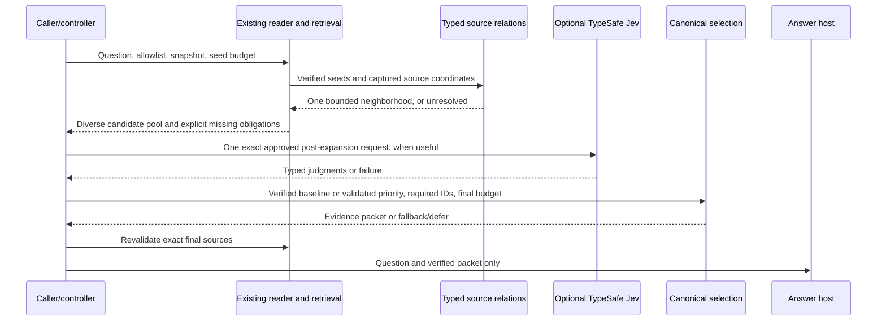
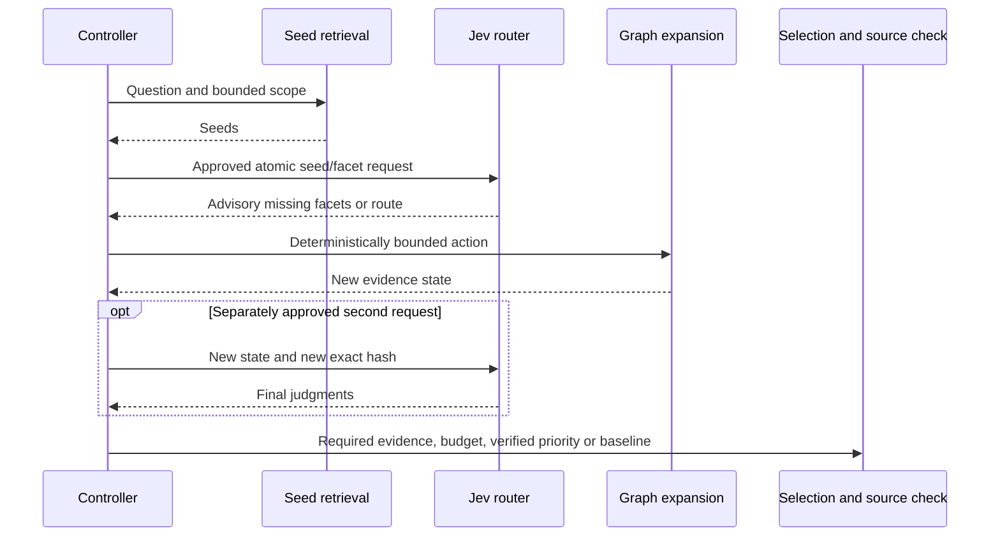
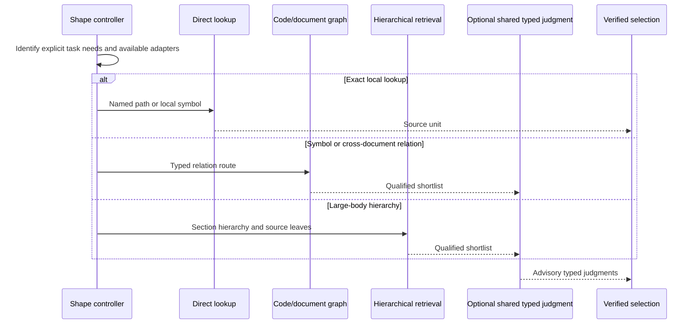

# VelGraphing PR #9 frontier audit and bounded repair

**Audit date:** 2026-09-18. **Disposition:** retain v3 as a measurement baseline; do not promote Graph + Jev or spend a new provider budget yet. **Delivery mode:** canonical report and patch fallback. **Integration owner:** local Parent.

This is an evidence-based remote source review with two locally tested helper repairs and a new offline evaluation utility. It is **not** a completed checkout-level acceptance audit. No executable checkout or GitHub write action was available. The six-corpus-task evaluation, complete consumer suite, package projection and final full suite were not run. The relationship-aware successor remains an implementation plan, not a measured product capability. Those limitations are acceptance blockers, not small print.

### Local checkout qualification addendum

The local implementation task applied the canonical patch to the exact assigned
commit on branch `gpt-pro/velgraphing-pr9-frontier-audit-repair`. It also added
one bounded evaluator repair. An empty ranked-candidate run set now fails schema
validation. This addendum supersedes only the checkout and validation status
statements below. The original remote audit and its claim boundaries remain
unchanged.

Local validation used the existing repository virtual environment and made no
provider, answer-model, or grader calls:

- supplied target checker and `git apply --check`: pass;
- new real-core helper tests: 6 passed;
- new evaluator tests: 17 passed, including the empty-run regression;
- existing retrieval and navigation consumers: 76 passed;
- Python compilation: pass;
- canonical projector and second-pass idempotence: pass;
- source-package parity: pass, candidate SHA-256
  `cdd44764b6f8655f0ed819f870af2366af1b92cb2237ca4bbfb7eb55afa2b9b0`;
- full offline repository suite: 412 passed, 0 failed, 0 errors, 1 skipped;
- original v3 result SHA-256 retained as
  `916c5e766b9152df5dac21b3cf3fec0116002dfee8d4f6c68eec9885bf94fd96`.

The projector changed only the portable retrieval copy, projection state, and
release manifest. Typed edges, expansion, selection, and live canary execution
remain outside this checkpoint.

## 1. Executive verdict

**Accept PR #9 as a useful, narrowly defined measurement baseline, subject to Parent's existing receipt and seal reconciliation. Reject it as evidence that a relationship-aware Graph + Jev architecture is either effective or ineffective.** It measured a tag index feeding a fixed, low-recall packet, followed by optional permutation and a stochastic answer/grader host. It did not exercise a relationship graph, expansion, semantic sufficiency or post-reranking context reduction. [R1–R6]

The leading diagnosis is a combination, with distinct owners:

| Layer | Finding | Owner |
|---|---|---|
| Candidate generation | Relevant evidence is often absent before Jev runs; independent development recall was never scored before live calibration. | Retrieval and benchmark owners |
| Source-span construction | A long-line window can exclude its own matched anchor. Repeated occurrences can consume the tag cap before identity deduplication. | Canonical retrieval core |
| Public graph entry point | The scanner supplies `Graph(records)` with no edges. Core has stronger retrieval/obligation seams, but the public route does not supply useful topology. | Graph adapter and retrieval owners |
| Packet selection | V3 collapses graph evidence to one span per path, expands excerpts and applies the answer budget before Jev. It then preserves all remaining members. | Benchmark controller; successor selection owner |
| Jev | The existing usefulness judgment cannot recover absent evidence. Its confidence is a distribution property, not a completeness certificate. No new Jev quality defect is established by task failure alone. | Judgment evaluation owner |
| Answer/grader host | Scheduling, answer generation and grading dominate wall time. One repetition and a timeout do not support a causal latency claim. | Host and benchmark owners |

**Selected next architecture:** deterministic source-bound seed retrieval, one bounded typed-neighborhood expansion, one optional post-expansion Jev request, explicit budgeted selection, exact source verification, and fallback/defer. Keep a simple Direct bypass. Reuse core models, retrieval, selection and source readers. Do not add a second scanner, persistent graph service, autonomous agent loop or local Jev provider.

**Implemented slice:** repair the two reproducible retrieval helpers; add a post-hoc v4 retrieval evaluator and public tests; add a blocked canary protocol. This removes demonstrable defects without pretending to establish the missing graph architecture. The supplied patch is reviewable but **not merge-qualified** until Parent runs the canonical consumers, projector and full suite.

**Live decision:** NO-GO now. Conditional canary design: C-02 and M-01, four arms, at most four Jev requests, eight answers and eight independent grades. Zero provider requests were made in this audit.

## 2. Candidate identity and checkout status

| Item | Observation |
|---|---|
| Repository | `Vel-Labs/velGraphing` |
| PR | [PR #9](https://github.com/Vel-Labs/velGraphing/pull/9), open and mergeable when read |
| Assigned and remotely observed head | `6931f0ffa72bd27f79f5515bd669404dbc4667d0` |
| Head branch | `codex/velgraphing-ttc-v3-measurement` |
| Assigned base | `main`, `031a8390ae3accce7fe4b3756f01f98f2c606ee6` |
| Implementation / retained-result commits | `689060171fa2b8d2427e11970c034704cef3d976` / `6931f0ffa72bd27f79f5515bd669404dbc4667d0` |
| Package identity | `package.json` reports private `graph-engineering`, version `0.1.6` |
| Proposed repair branch | `gpt-pro/velgraphing-pr9-frontier-audit-repair` |
| Repair branch / new head | **Not created / null** |
| Stacked PR | **Does not exist** |
| Executable checkout | **Unavailable**; repository text was read through the GitHub connector |
| Environment | Python 3.13.5, Node v22.16.0, npm 10.9.2, Git 2.47.3 |
| Existing parser dependencies | `tree_sitter` and `tree_sitter_javascript` unavailable; none installed |

The connector could read repository content and PR/CI metadata but exposed no branch, push or create-PR action. A separate credential-blind clone failed DNS resolution; raw/archive retrieval did not produce a checkout, and the connector does not expose arbitrary binary repository archives. Repository metadata permissions must not be confused with an available write operation. No credentials were requested, read or stored. [R1, R7]

The assignment's `packages/core/graph.py` is absent at this candidate. The graph types are in `packages/core/models.py`, exported through the core package. This is an inventory correction, not proof of a missing graph implementation. [R8]

### Identity anchors for the patch

- `packages/core/retrieval.py` Git blob: `17d72b8d14dfdfb46fb437a27630b866d0d68d79`.
- `result.json` Git blob returned by the connector: `f3986f2d6f242ef9eeb0e3ade1773336e1130a83`.
- Assignment-supplied v3 file SHA-256: `916c5e766b9152df5dac21b3cf3fec0116002dfee8d4f6c68eec9885bf94fd96`.
- Assignment-supplied original 87-file source-package SHA-256: `644d997f372e488c8e599babfbfeac61cbab7ed559c7188996d956d29793a939`.

The latter two SHA-256 values were **not independently recomputed from complete local bytes**. The patch checker requires the v3 result seal before application. No sealed result or original candidate branch was edited here. Original parity cannot be claimed for the changed helper source.

## 3. Exact PR #9 validation reproduced

Remote GitHub Actions run `35400601662` reported successful jobs `105779358022` (`offline (3.11)`) and `105779358077` (`offline (3.13)`). Their successful steps included the focused checks, full offline suite, two-pass package projection/parity and retained-public-bookkeeping inspection. This reproduces **remote validation state**, not execution or exact test counts in this environment. [R7]

The assignment reported scaffold 11, core 229, adapters 18, skills 29, benchmarks 92, parity 10, plus a 49-test focused audit and reconciliation of 24 completed receipts and 12 approval/request bindings. Those remain **operator-provided prior results**, not newly reproduced counts. The underlying private completed receipts and approval artifacts were not available here.

The retained result's selected fields were independently recomputed in `evidence/recompute_v3.py`, from a clearly identified manual transcription in `evidence/v3-observations-extracted.json`. This checks the reported arithmetic, not the complete result seal or private receipt chain. It must not be represented as an independent re-run of the 24 trials.

### Coverage disclosure

Read: product/portability contracts and graph/Jev skills; core model, retrieval, selection and V5 implementation sections; source-coordinate contracts; v3 configuration/result and main calibration/packet/host/handoff/Jev/graph-instrumentation paths; packet, host and Jev benchmark tests; frozen questions and oracle; corpus freeze and manifest metadata. Some long source/test/manifest responses were truncated or only inspected in relevant sections. No claim is made that every tracked caller, every test body, every manifest row, or every corpus file was exhaustively read. A final targeted read confirmed that `navigate` skips empty excerpts before constructing `SourcePreview` and `_verified_spans` skips empty ranges; these inspected consumers tolerate an unrepresentable anchor without substituting unrelated evidence. This source trace is not a consumer-test pass. The default-branch code search returned no `_line_window` results and is not a substitute for a pinned-checkout `git grep`.

This is a material difference from the requested complete checkout-level audit. Parent must complete the inventory and consumer search in section 18 before accepting the patch.

## 4. Current product and benchmark call graphs

### Direct A and B in v3

```text
run_registered_trial
  -> verify restricted materialized lane against frozen manifest
  -> build_candidate_packet(route="direct")
       -> read allowlisted sources
       -> rank files with flat lexical/path scores
       -> choose one best line-neighborhood span per file
       -> _capture: at most 6 candidates, 4096 bytes each,
                    16384 aggregate answer-evidence bytes
  -> B only: exact preview -> approval -> reserve one call
             -> canonical Jev.evaluate -> validate response -> revalidate sources
  -> compose_answer_payload: re-read exact sources; include every selected member
  -> fresh native answer subprocess/file handoff
  -> separate native grader with oracle context
  -> controller-owned result and monotonic timing
```

### Graph C and D in v3

```text
run_registered_trial
  -> observe_graph_find
       -> isolated copy of shipped graph_find.py
       -> _scan: tracked, restricted source capture
       -> Graph(records), no edges
       -> core graph_find
            -> source-verified tag index
            -> prompt facets / ranking / bounded source pointers
  -> build_candidate_packet(route="graph")
       -> first evidence choice per path
       -> expand a pointer toward a 4096-byte excerpt
       -> _capture applies the 16384-byte answer budget BEFORE Jev
  -> D only: same opt-in Jev approval/validation path
  -> exact-source answer payload -> fresh answer -> independent grader
```

`observe_graph_find` wraps the real scanner/index/retrieve functions rather than fabricating graph statistics. It records file reads and captured-memory reads as different source-operation kinds. Therefore total source-operation counts must not be renamed disk-read counts. It marks warm loading not applicable; no warm-cache benefit was measured. [R2–R6]

### Existing stronger canonical seams

Core contains graph records and typed relation strings on edges, relation-aware ranking, one-hop expansion, proof obligations, source-coordinate evidence, hybrid assistance and verified selection. It is not merely the public tag-index script. However:

1. `_scan` returns no edges, so the measured route cannot traverse a relationship.
2. `_verified_spans` explicitly excludes hop-one hits without anchored obligations. Simply adding edges or observing a nonzero count does not prove that neighbor evidence reaches the final packet.
3. `retrieve_hybrid` and `assist` provide bounded fallback/obligation mechanisms, but their scope must be explicitly supplied. They do not certify unrestricted question completeness.
4. `selection._validate_spans` canonicalizes/sorts optional spans. A future caller that merely passes Jev's reordered list through that path can erase the intended rank before budget selection. V3's custom composer does not use that selection path, so this is a successor integration risk, not a v3 cause.
5. V5 has bounded coordinate navigation and source reads, not a complete mixed-corpus relationship extractor. It does not supply a ready universal graph or semantic sufficiency oracle. [R3, R8–R10]

### Source and authority boundary

The scanner and canonical readers establish source identity, caller containment, regular-file handling and digest checks. GraphRecord provenance is not a license to trust arbitrary metadata. New edges require both admitted endpoints and a recoverable, verified source basis. An `imports` relation must come from an actual import statement, not similar filenames. A documentation link must be explicit and resolve inside the caller scope. A symbol reference must be unambiguous or remain unresolved.

The current tag index checks source-complete record content. Introducing partial section bodies as ordinary source records would violate that custody contract. Keep existing source records and coordinate views; do not duplicate code or paragraphs in edge metadata. Relation extraction must consume existing verified captures, not rescan the repository or follow remote links.

## 5. Research review with source-to-design mapping

All sources below were accessed on **2026-09-18**. Vendor statements, academic experiments and community implementations are not interchangeable evidence. No published benchmark number is adopted as an expected VelGraphing effect size.

### TypeSafe and comparative implementations

| Source / status | Relevant evidence | Consequence for VelGraphing |
|---|---|---|
| [T1] Official TypeSafe agent skill, Git blob `0109513f9656917dc93cbc5ecddfca465a53ce66` | Shared state, independent typed questions, deterministic composition; later state needs a later request. | Batch genuinely independent judgments once. Do not design a same-request feedback loop. |
| [T2] HTTP API and [T3] model documentation, vendor contract | `Choice`, `Score`, `Noul`; stable version still `jev-1.13.0` when read; moving aliases differ from version pins. | Keep TypeSafe supported; pin and retain resolved version. Schema validity is not quality validation. |
| [T4] Advanced questions, vendor guidance | Structured instructions and explicit, independent criteria are supported. | Version instructions, levels, state and response handling together. A vague compensating usefulness average should not own safety decisions. |
| [T5] Confidence and [T6] confidence routing, vendor guidance | Score/Choice confidence summarizes a distribution, not factual completeness or permission. Thresholds depend on task consequences. | Do not interpret high confidence on an irrelevant candidate as confidence in the task answer. Calibrate on held-out candidate labels. |
| [T7] Official reranking cookbook, vendor example | Retrieval creates a high-recall shortlist first. The reranker only sees that shortlist. | Repair candidate recall and the pre-Jev cutoff before adding calls or tuning thresholds. |
| [T8] Official RAG-passage classifier, vendor example | Separate relevance, usable evidence, contradiction and injection-related judgments feed deterministic routing. | Separate safety vetoes from preferences. No weighted average may cancel an instruction-risk signal. Example thresholds are not approved thresholds here. |
| [T9] Citation checking, vendor example | Check a literal quote's presence and separately judge its contextual support. | Existing citation-ID membership is a schema check, not claim support. Preserve independent source grading. |
| [C1] Simple Jev, community implementation | Shared-prefix reuse, direct label scoring, a versioned prompt contract and separate schema/quality concerns. Explicitly disclaims reproducing TypeSafe architecture, training, accuracy, calibration and speed. | Transfer interface/testing ideas only. Do not install it or infer vendor performance from it. |
| [C2] Jev reproductions tracker, community listing, page snapshot 2026-09-17 | A discovery/popularity surface, not a controlled quality comparison or official TypeSafe release. | No model substitution or performance claim follows from its rankings. |

**Judgment design decision:** keep the production `evidence-usefulness-v1` contract unchanged in this bounded patch. The current score conflates some useful distinctions, especially direct policy/documentary evidence versus implementation-oriented usefulness, but no labeled candidate evaluation currently justifies a replacement threshold or routing rule.

For later qualification, a small `evidence-judgments-v2-draft` could use a relevance Score, an independent usable-evidence judgment and an independent source-instruction-risk judgment. Facet contribution can be asked against **question-derived, caller-visible facets**, not oracle facts. Add contradiction only against an explicit claim or comparison target; otherwise it is underspecified. Redundancy can initially be exact-range overlap in code. Packet sufficiency, if asked, is advisory and must include an insufficient/unknown outcome. None of these draft semantics is implemented or declared calibrated here.

### Code graphs and mixed-corpus retrieval

| Source / status | Evidence and limitation | Design consequence |
|---|---|---|
| [G1] RepoGraph, ICLR 2025 | Source-line definition/reference and containment graph; seed-local neighborhood use. Larger neighborhoods are not automatically better. | Start with one bounded neighborhood, source pointers and an edge-removal control. A file catalog is not equivalent to this topology. |
| [G2] CodexGraph, NAACL 2025 | Explicit repository relations and iterative query construction. Its edge-removal ablation shows model-dependent effects; removing edges also changes available queries. | An edge ablation must keep VelGraphing seeds, caps and controller behavior fixed. Do not borrow a universal gain estimate. |
| [G3] Code Graph Model, NeurIPS 2025 | Retrieval, reranking and a graph-aware reader are co-designed. | Its results are not evidence that appending edges to an ordinary text packet will reproduce the benefit. |
| [G4] Microsoft GraphRAG docs/query modes | Local, global, DRIFT and basic text retrieval serve different query needs. Index construction and summaries are not free. | Keep Direct and hybrid controls; use source leaves for detail. Do not introduce community-summary infrastructure before a local typed slice earns its cost. |
| [G5] HippoRAG, NeurIPS 2024 | Entity/relation extraction and query-seeded graph traversal aggregate multi-hop evidence. | Multi-hop needs connectivity and adequate seeds. Extracted semantic relations must not become authority-bearing edges here. |
| [G6] RAPTOR, ICLR 2024 | Recursive clustering and generated summaries support hierarchical retrieval over long material. | A heading tree is a cheaper deterministic adapter, not a reproduction of RAPTOR. Preserve exact source leaves and test long singular documents separately. |
| [G7] WildGraphBench, ACL 2026 | Heterogeneous graph-grounded questions expose differences between aggregation and fine-grained evidence needs. | Measure exact local lookup, neighborhood, multi-document and holistic/hierarchical tasks separately. |
| [G8] BRINK, EACL 2026 | Incomplete knowledge structures and reasoning evaluation can expose failures hidden by easier or memorized answers. | Include missing-link, missing-evidence and safe-defer controls. A fluent answer is not source-complete reasoning. |
| [G9] Dissecting GraphRAG, TACL 2026 | Graph coverage and representation choices affect performance; expensive/generated structures are not automatically superior. | Prove source coverage first. Treat deterministic representations and text baselines as serious competitors. |

The PDFs used for substantive figure/table analysis were also visually inspected through PDF screenshots, including the CodexGraph and Code Graph Model ablation tables. One caution from that inspection: CodexGraph Table 3's GPT-4o no-edge exact-match value is 16.40 versus 27.90 for the full configuration; nearby prose uses a different value. The conclusion here relies on the qualitative, model-dependent ablation and does not convert that discrepancy into a VelGraphing claim. [G2]

### Four retrieval needs, one bounded envelope

Exact local lookup needs a direct path/symbol hit and a complete local unit. Symbol-neighborhood retrieval needs explicit definitions/references/imports and coordinate-preserving expansion. Cross-document synthesis needs several evidence-bearing passages and explicit references when available, not one excerpt per file. A large singular body of work needs heading/section hierarchy and a way to retain detailed leaves alongside broader context.

Use a common source-identity and coordinate envelope with small source-specific adapters. Python `ast` can supply deterministic declarations, lexical containment and imports without a new dependency. Existing JavaScript parsing can be reused where installed; no new parser is authorized here. Markdown headings/explicit links and reStructuredText directives/references need their own syntax handling. Dynamic dispatch, ambiguous imports, implicit conceptual links and semantic citations are unresolved relations, not invented facts. A code-only schema is unsuitable for OpenChain or a handbook.

## 6. Claim-to-evidence matrix

| Claim | Evidence class | Verdict |
|---|---|---|
| PR9 is open at the assigned candidate with successful 3.11/3.13 CI | Remote metadata | Verified when read; not a local rerun |
| Graph/off passed C-02; only one of 24 trials passed | Retained public result | Supported as retained outcome |
| All mean TTC values must remain null | Frozen rule plus outcomes | Supported |
| Direct and Graph overlapped 2/19 and 3/19 oracle spans | Assignment's post-run diagnostic | Not independently reproduced here; not semantic recall |
| Measured Graph had zero edges | Scanner source, graph instrumentation and retained observations | Supported |
| Jev reduced paired answer packet size | Composer contract and paired byte observations | False for v3 |
| D used 31.4% fewer provider input tokens than B | Recomputed selected retained fields | Supported only for Jev provider input usage |
| D's Jev request was smaller by serialized bytes | Recomputed selected retained fields | False on the means: D was larger |
| Jev transport caused the 100-plus-second wall times | Provider versus total intervals | Not supported |
| Jev ranking caused C-02's C/D outcome difference | Stable descending D scores and unchanged paired packet construction | Not supported; evidence order is unchanged |
| Confidence was calibrated for these candidates | No held-out candidate-label reliability study | Prohibited claim |
| The window helper can exclude a matched anchor | Exact-function public reproduction | Verified |
| The tag cap can discard later unique terms after repeated occurrences | Exact-function injected-extractor fixture | Verified algorithmically; real extractor consumer test still unrun |
| The supplied helper patch improves six-task recall | No materialized corpus run | Unknown |
| The selected typed architecture is implemented and accepted | No typed adapter or edge ablation in this patch | False |
| Full changed-candidate suite and package parity pass | No executable checkout/projector run | Unknown; acceptance blocked |

## 7. Layer-by-layer causal diagnosis

“Should PR9 change?” below means whether to rewrite the sealed v3 treatment/result. The answer is generally no: corrections belong in a stacked successor, while the baseline is documented accurately.

| Observed fact | Evidence / affected layer | Likely mechanism | Alternative / confidence | Discriminating experiment | Owner / should PR9 change? |
|---|---|---|---|---|---|
| 1/24 answers passed | Retained result; full pipeline | Poor fixed evidence plus strict fact/critical gates | Answer stochasticity, grader behavior, question/rubric alignment; medium causal confidence | Oracle-blind retrieval scoring, then repeated answers on identical packets | Retrieval + benchmark + host; preserve v3 |
| Direct overlap 2/19 | Supplied path/range diagnostic; seeds/packet | One lexical window per file misses distributed facts | Alternative supporting text outside listed spans; medium | Recompute exact ranges and independently score semantic support | Retrieval; preserve v3 |
| Graph overlap 3/19 | Same diagnostic; graph adapter/packet | Tags and first-per-path collapse miss relevant sections | Oracle is not exhaustive; medium | Score candidate pool before and after each reduction | Retrieval + packet; preserve v3 |
| Zero graph edges | `_scan` return, observations; graph entry point | No relation extraction on public path | Not absence of all canonical graph support; high | Actual typed-edge fixture and edge-disabled output diff | Adapter; successor only |
| Cold build/retrieval near two seconds on average | Instrumented phases; retrieval | Source capture, indexing and custody checks | File sizes, CPU, repeated prefix encoding and memory reads; timing mechanism only partly established | Profile same captured bytes, separate build/load/query, retain tails | Retrieval/performance; preserve v3 |
| D provider input 31.4% below B | Provider usage; request content | Different shortlist contents/tokenization | Not smaller serialized volume or proven shared-state reuse; high on arithmetic, low on precise tokenizer cause | Exact request-level content/usage comparison without changing model/rubric | Benchmark interpretation; no result rewrite |
| Paired answer packet bytes unchanged by Jev | Membership-preserving composer | Only order can change after preselection | Order might affect answer quality, but cannot remove context here; high | Post-rerank budget selection under frozen pre-Jev shortlist | Selection/controller; successor only |
| Provider means below 0.5 seconds | Controller provider intervals | Typed judgment is a small part of measured wall time | Client/server timing split unknown; high on observed share | Separate queue/answer/grade/provider clocks | Host/measurement; preserve v3 |
| D 22.0% slower than B excluding approval | One retained repetition | Host/answer/grader/content variability dominates | Retrieval effects possible; no causal attribution; low | Counterbalanced repeated paired trials with host queue receipts | Host/benchmark; preserve v3 |
| High distribution confidence on failed tasks | Candidate scores/probabilities | Confidence may favor irrelevance; it does not judge whole-task success | Some candidate judgments could also be wrong; unresolved without labels | Candidate semantic labels and reliability diagrams | Jev evaluation; no retrospective threshold tuning |
| Answer/grader tokens unknown | Null usage and native boundary | Host did not expose verified usage | Not evidence that usage was zero; high | Capture actual host completion usage with provenance | Host; successor instrumentation |
| A-C-02 measurement error | Retained grader timeout | Timeout consumed terminal wall without a passing grade | A correct answer may or may not have existed; unresolved | Inspect original answer/grade receipt; separate replay from a new registered trial | Host/benchmark; preserve failure |
| One repetition per task/arm | Registration | Descriptive sample cannot identify noisy answer/latency effects | Large deterministic input differences are still measurable; high | Repeated paired trials; fixed payload replay for host variance | Benchmark; successor only |
| No fallback/incremental expansion | Frozen calibration | Missing evidence cannot be repaired | Intentional isolation, but not realistic adaptive product behavior; high | Separate adaptive v4 protocol while retaining v3 stress test | Controller; preserve v3 |
| Candidate calibration unscored | Calibration contract | Transport/caps qualified, retrieval usefulness not validated | Pilot may intentionally seek rejection evidence; high | Gate 2 before more live judgments | Benchmark; successor only |
| Arm mean TTC null in every arm | All-pass policy and failures | Registered failures stay in denominator | Not missing arithmetic or a bug; high | No corrective experiment needed; report success rate and terminal wall separately | Reporting; no change |
| C-02 C passed, D failed despite unchanged evidence order | Scores, pair bindings, composition; host | Fresh answer/grader behavior or outer host context | Does not identify which lane erred; high that harmful reordering is not the cause | Blind repeated identical-payload answer/grade runs | Host/benchmark; preserve v3 |
| Graph requests were larger by bytes despite lower tokens | Request telemetry | Content composition differs | Escaping, language, internal token accounting may matter; mechanism unresolved | Compare captured requests and native provider token accounting | Measurement; correct interpretation only |
| Window can lose its own anchor | Exact helper fixture; core | No nearby newline resets start to zero before truncation | Contribution to the six frozen tasks is not established; high local, unknown corpus effect | Public fixture plus exact-corpus candidate diffs | Core; apply bounded successor patch |
| Repeated tags consume cap before dedup | Exact helper fixture; core | Cap counts occurrences, not retained identities | Remaining first-occurrence bias still exists; high local | Real extractor consumer and corpus vocabulary/candidate diffs | Core; apply bounded successor patch |

### Important quantitative corrections

Provider input totals are B = 50,361 and D = 34,538, a reduction of 15,823 tokens. But mean serialized Jev request bytes are B = 21,200.33 and D = 21,742.67; mean shared-state bytes are B = 16,509.50 and D = 17,237.67. The “smaller Graph request” explanation is not supported by those byte metrics. [R5; local recomputation]

| Task | D minus B provider input tokens |
|---|---:|
| C-01 | +156 |
| C-02 | +12 |
| S-01 | +201 |
| L-01 | -288 |
| M-01 | -7,963 |
| M-02 | -7,941 |
| Total | -15,823 |

The four non-OpenChain tasks net **+81** tokens; the two OpenChain tasks net **-15,904**. All net reduction is concentrated in those two tasks. This is a content-specific observation, not a general graph compression factor. No language or tokenizer mechanism is asserted without the original request contents.

The no-approval D-minus-B wall differences also vary substantially: approximately +4.97, -22.73, +94.24, +7.02, +19.51 and +38.38 seconds in task order. The aggregate +22.0% is descriptive, not a clean treatment effect. A-C-02's 294.26-second terminal wall includes a grader timeout and contaminates any simple A-relative average comparison.

No “regression” between v2 and v3 is claimed. Their source-access and measurement boundaries differ, so their aggregate outcomes are not an unchanged-metric comparison.

## 8. Findings ranked P0 through P3

No P0 defect was established in the inspected paths. This is not a claim that an exhaustive security audit passed.

### F1. P1: measured graph does not exercise relationships

**Files/lines:** `plugins/graph-engineering/skills/graph-find/scripts/graph_find.py:260–281`, especially the return at 281; `packages/core/retrieval.py:1596–1647` for hop-one evidence filtering; `scripts/benchmarks/time_to_correct_graph.py::observe_graph_find`.

**Observed:** zero supplied edges; the public adapter retrieves through tags. **Expected:** a relationship claim requires source-grounded typed edges whose removal measurably changes retrieval. **Evidence:** exact scanner return, instrumentation and retained counts. **Root cause:** missing adapter topology plus a benchmark entry point that does not exercise stronger core behavior. **Repair:** reuse the scanner capture and core graph/obligation seams; introduce only explicit relations with recoverable source coordinates, followed by one bounded expansion. **Validation:** not implemented or passed here; Gate 1 and edge-disabled ablations are blockers. **Residual risk:** adding nonzero edges alone can still produce identical evidence because hop-one units without obligations are excluded.

### F2. P1: shortlist is reduced before Jev can select useful evidence

**Files/lines:** `scripts/benchmarks/time_to_correct_packet.py:100–243` (`_direct_pointers`, `_graph_pointers`, `_capture`); `scripts/benchmarks/time_to_correct_calibration.py::run_registered_trial`.

**Observed:** one graph evidence choice per path, expansion toward 4,096 bytes, then a 16,384-byte cutoff before Jev. Four full-size excerpts exhaust the budget, regardless of a six-candidate maximum. All candidates emitted by this builder are optional. **Expected:** a high-recall candidate pool distinct from the final answer packet; required evidence rules explicit; multiple nonredundant spans from one file allowed. **Root cause:** candidate and answer budgets are coupled too early. **Repair:** successor-only shortlist/final-packet separation, diversity and required-reserve controller. **Validation:** offline pre/post-stage recall and exact membership tests required; not run here. **Residual risk:** increasing K without better spans only increases provider input and selection burden.

### F3. P1: long-line source window can exclude the matched anchor

**Files/lines:** `packages/core/retrieval.py:2074–2083`; consumers include `_verified_spans` at 1596–1647 and `_complete_unit_bounds` near 1948–2071.

**Observed:** exact-function reproduction returns bytes 0–800 for a valid anchor at 5,400–5,417. **Expected:** a nonempty admissible window contains the entire anchor, stays within the byte limit and uses UTF-8 boundaries. **Root cause:** failure to find a nearby newline sets the left boundary to zero; truncation then preserves the wrong prefix. **Repair implemented:** bounded anchor-centered fallback, inward UTF-8 boundary alignment, explicit empty range for an over-budget/invalid-character-boundary anchor. No source reader or authority rule changes. **Validation:** eight isolated window tests, including 3,000 seeded UTF-8 cases; canonical consumer tests supplied but not run. `_verified_spans` already skips empty ranges. **Residual risk:** all pinned call sites and unusual complete-unit callers still require checkout-level verification; this is not proof that the defect caused a particular v3 failure.

### F4. P2: tag cap counts duplicate occurrences before retained identities

**Files/lines:** `packages/core/retrieval.py:672–707`, particularly 692–704.

**Observed:** sorting and slicing precede identity deduplication. Thousands of one term can suppress a later unique term. **Expected:** preserve the same deterministic representative/order while applying the cap to distinct retained identities. **Root cause:** cap placement. **Repair implemented:** count successful identity insertions and stop at the unchanged cap. **Validation:** seven isolated tests cover duplicate crowding, deterministic order, per-record caps, kind priority and source-custody failures; an actual `build_repository_tag_index` consumer fixture is supplied but unrun. **Residual risk:** first-occurrence-only tagging remains; more retained vocabulary may increase downstream work or change rankings. No speed or six-task recall claim is made.

### F5. P2: an existing selection seam can erase a future Jev order

**Files/lines:** `packages/core/selection.py::_validate_spans`, inspected in the 566–900 section; `select_context` and `_choose_graph_spans` consumers.

**Observed:** optional spans are canonicalized/sorted before budget composition. **Expected for a Jev-enabled successor:** explicit, validated priority survives into optional selection while required spans remain guaranteed. **Evidence:** source flow, not a v3 runtime failure. **Root cause:** the existing seam was not designed as an arbitrary external rerank-order channel. **Repair:** add a narrowly validated priority parameter with unchanged default behavior, or use an existing order-preserving seam after demonstrating it. Do not silently change all callers. **Validation:** priority reversal under a tight budget, required-lock preservation, duplicate/foreign-ID rejection, and all existing consumers. **Residual risk:** unimplemented; exact final function-line inventory awaits the complete checkout.

### F6. P2: citation-ID parsing can reject unrelated brackets and does not prove support

**Files/lines:** `scripts/benchmarks/time_to_correct_host.py:199–207`, particularly 204; `tests/benchmarks/test_time_to_correct_host.py::test_v3_answer_requires_known_evidence_citation`.

**Observed:** a broad bracket regex treats a normal `[asyncio]` label as a candidate citation. Existing tests cover missing/unknown/known IDs, not ordinary Markdown brackets. **Expected:** a versioned, unambiguous citation grammar plus independent claim/source support checks. **Evidence:** source and corroborating PR review comment; no retained v3 failure was attributed to this parser. **Root cause:** presentation syntax and evidence-reference syntax overlap. **Repair:** v4-specific grammar/structured references; retain rejection of unknown evidence IDs and do not weaken the grader. **Validation:** known/unknown IDs, Markdown link labels, code/list brackets, zero citations, and claimed support checks. **Residual risk:** historical v3 parser unchanged in this patch.

### F7. P2: empty matching files can abort Direct candidate construction

**Files/lines:** `scripts/benchmarks/time_to_correct_packet.py:132–134` and `_capture`.

**Observed:** an empty file with a matching filename can survive a positive path score and produce range `(0,0)`; capture rejects the entire packet. **Expected:** skip zero-length evidence before the top-K limit while retaining valid candidates. **Evidence:** code and PR review comment; an empty `graphs/__init__.py` exists in the frozen manifest, but no claim is made that it triggered a retained trial. **Root cause:** range validity is checked too late. **Repair:** v4 builder validity filtering before ranking cutoff. **Validation:** empty marker plus valid source, all-empty corpus safe defer, no silent source error masking. **Residual risk:** historical v3 behavior remains sealed.

### F8. P2: L-01 question/rubric alignment needs adjudication

**Files/lines:** `benchmarks/velgraphing-corpus-pilot-v1/corpus/questions.json` L-01 and `corpus/oracle.json` L-01 required fact 3.

**Observed:** the question explicitly asks about read scaling, traffic/cache assumptions, scaling choices and statelessness; the oracle additionally requires batch-allocated IDs and buffered Kafka. **Expected:** required facts should be clearly requested or necessary to answer the registered question. **Evidence:** independent question/oracle comparison. **Root cause:** possible rubric over-specification; **unresolved**, not a proven grading error. With five equally scored facts, omitting one whole noncritical fact yields 0.80 even when the rest are exact. **Repair:** independently adjudicate alignment; any clarified question/rubric belongs in a successor freeze, never a lower threshold or rewritten v3 result. **Validation:** blind human/source review before new trials. **Residual risk:** the detail may be defensible as part of separating write coordination from redirects; the original answer/source artifacts were not available to settle that interpretation.

### F9. P2: candidate confidence and semantic quality are not calibrated

**Files/lines:** `packages/core/jev.py:22–32` rubric; v3 result candidate observations; calibration qualification path.

**Observed:** transport/schema qualification and source-free score retention exist, but candidate-level semantic labels and held-out reliability do not. **Expected:** evaluation at the level of the actual judgment. **Evidence:** rubric and retained observation design. **Root cause:** quality evaluation lagged transport integration. **Repair:** outside-input candidate labels, exact-request replay where valid, separate ranking and routing metrics; draft atomic semantics only after qualification. **Validation:** unrun. **Residual risk:** public summaries cannot be replayed against changed states, and high confidence can correctly mean “irrelevant.”

### F10. P3: timing/usage interpretation exceeds what a single run can identify

**Files/lines:** v3 result, `time_to_correct_host.py::_record_usage`, graph/Jev instrumentation, native handoff.

**Observed:** missing native usage, one repetition, large host intervals and one timeout. **Expected:** explicit nulls, separate clocks and descriptive rather than causal comparisons. **Repair:** interpretation in this report; successor host usage/queue receipts and repeated paired design. **Validation:** selected-field arithmetic reproduced; no host-speed experiment performed. **Residual risk:** host queue and generation/grading variability remain unresolved.

## 9. Architecture alternatives and decision

### Alternative 1: separate retrieval/expansion from one final Jev judgment: selected for qualification



**Owners:** scanner/reader for custody; core relation adapter and retrieval for candidate generation; controller for budgets, obligations and fallback; Jev adapter for typed judgment only; selection for packet construction; host for answer and actual usage.

**Correctness mechanism:** preserve seed recall, add only recoverable neighbors, retain multiple useful units per file, reserve required evidence, and stop/defer when obligations cannot be satisfied. This is coverage of declared obligations, not a semantic completeness guarantee.

**Context/time mechanism:** select a smaller final packet from a larger qualified shortlist. Any savings must exceed added graph/Jev/custody work. Earlier correct retrieval may avoid answer repairs, but that benefit needs an adaptive benchmark. A pure permutation of an already-final packet cannot establish compression.

**Provider calls:** zero when off or structurally no-op; normally one for an enabled trial. No second-state request in the first successor. **Cold:** capture, index and relation extraction charged. **Warm:** caller-owned in-memory capture/index reuse may be measured only with matching scope, source identity, extractor/rubric versions and freshness checks; no cache service is proposed.

**Failure:** no provider retry; restore verified baseline order/selection. Missing facets trigger at most one caller-allowlisted bounded fallback pass, otherwise defer. Invalid/stale evidence is never answered from. **Cost:** smallest added control surface that can isolate recall from judgment. **Proof:** Gate 1 edge/source behavior, Gate 2 critical recall, Gate 3 candidate labels, then the canary.

### Alternative 2: Jev-guided graph expansion: rejected for the first successor



**Correctness mechanism:** model identifies useful expansion targets that lexical rules miss. **Time/context mechanism:** avoid unnecessary expansion or fetch only relevant neighbors. **Calls:** one early call, or two when new evidence needs final judgment. Same-state questions cannot inspect each other's answers, so a hidden one-request feedback loop is invalid. **Cold/warm:** graph costs remain, plus early state serialization. **Failure:** deterministic fallback must still work without the router. **Boundary:** Jev may suggest a facet but cannot invent a file permission or source obligation. **Maintenance:** new route semantics, calibration, second approval/state binding and more failure cases. **Rejection reason:** no evidence yet that early Jev advice adds value; the dominant known defects are upstream deterministic omissions. Reconsider only after labeled expansion decisions outperform the selected alternative.

### Alternative 3: broad task-shape routing with specialized adapters: rejected as initial implementation scope



**Correctness mechanism:** use a retrieval structure suited to the task. **Time/context mechanism:** avoid graph overhead on exact lookup and avoid exhaustive detail on holistic questions. **Calls:** zero/one per chosen route, not implicitly one per adapter. **Cold/warm:** adapter-specific preparation must be charged and invalidated. **Failure:** unsupported task shape falls back to verified Direct or defer, never an invented graph. **Boundary:** one caller allowlist/source envelope across every adapter. **Maintenance:** highest routing/schema/evaluation matrix of the three. **Rejection reason:** it introduces several unproved subsystems before a single relationship-enabled seam has passed an ablation. The selected alternative includes a simple Direct bypass, not a universal learned router or community-summary service.

### Minimum useful topology by development task

| Task | Smallest plausible structure | Important limit |
|---|---|---|
| C-01 | Explicit API documentation references plus source declarations/containment; several windows in `tasks.py` and docs | A file edge alone cannot supply all distant definitions |
| C-02 | Documentation-to-symbol references and declaration units; preserve both mapping directions | Existing Graph/off pass is a control, not proof that edges are necessary |
| S-01 | Direct named-path lookup and complete function unit | Graph overhead is unnecessary unless an independently justified dependency is needed |
| L-01 | Heading/section units across two named chapters; explicit links where present | This is cross-chapter synthesis, not a full holistic-book benchmark |
| M-01 | FAQ sections with explicit checklist references if present | Oracle support is concentrated in one FAQ; graph-expected is only a hypothesis |
| M-02 | Playbook sections plus FAQ boundaries; explicit document links where available | Do not promote optional examples to authority or infer normative edges |

## 10. Files changed and why

The canonical patch proposes the following repository changes. They have not been applied to an actual Git checkout here.

| File | Change |
|---|---|
| `packages/core/retrieval.py` | Two helper bodies only: anchor-preserving byte window and distinct-identity tag cap |
| `tests/core/test_retrieval_pr9_helpers.py` | Six real-core consumer tests, including source-custody and actual tag extraction; supplied, not executed |
| `scripts/benchmarks/time_to_correct_retrieval_eval_v4.py` | New stdlib post-hoc scorer for immutable ranked candidates and separate labels; never retrieves or calls a model |
| `tests/benchmarks/test_time_to_correct_retrieval_eval_v4.py` | Sixteen public scorer/schema/containment/unknown-value tests |
| `benchmarks/velgraphing-time-to-correct-v4/PROTOCOL.md` | Successor evaluation ladder, canary caps and held-out design |
| `benchmarks/velgraphing-time-to-correct-v4/canary-plan.json` | Machine-readable blocked plan; authorization false; preview hashes null |
| This report | Canonical audit, findings, limits and local Parent instructions |

No Jev production rubric, request authority, response validation, source reader, grader threshold, package version or sealed v1/v2/v3 result is changed. No generated runtime file is hand-edited. Package-consumed core source has changed, so generated projections must be regenerated and inspected by Parent before acceptance. This handoff does not falsely bundle an unverified generated projection.

Additional handoff-only files include exact helper fragments with provenance, the isolated algorithm tests, arithmetic inputs/scripts, validation logs, an expected-target checker and the final patch. These are not presented as a reconstructed repository.

## 11. Tests and exact results

### Executed locally

```sh
PYTHONDONTWRITEBYTECODE=1 python3 -m unittest discover \
  -s /mnt/data/velgraphing-audit/isolated_tests \
  -p 'test_helper_repair.py' -v
# 15 tests, 0 failures, 0 errors. Includes 3,000 seeded UTF-8 cases.

PYTHONDONTWRITEBYTECODE=1 python3 -m unittest discover \
  -s /mnt/data/velgraphing-audit/repo_additions/tests/benchmarks \
  -p 'test_time_to_correct_retrieval_eval_v4.py' -v
# Final evaluator: 16 tests, 0 failures, 0 errors.
```

These are **31 distinct local tests**, not the repository's full/core test count. The helper tests execute exact function-body transcriptions with an injected tag extractor; the evaluator tests execute the actual new evaluator file. Six canonical-core consumer tests were added but not imported or executed. Three new repository Python files passed AST parsing; syntax validation is not import or behavioral validation.

The supplied patch is also checked for syntactic applicability against an explicitly labeled source-fragment fixture, and its application must produce the exact proposed helper bodies. That check is not a substitute for `git apply --check` against the complete pinned repository. See `evidence/patch-check.json` for the final result and scope.

### Required but blocked here

| Required command | Status / exact counts |
|---|---|
| `PYTHONDONTWRITEBYTECODE=1 python3 -m unittest discover -s tests/benchmarks -p 'test_time_to_correct_*.py' -v` | Not run against the repository; count unknown |
| `PYTHONDONTWRITEBYTECODE=1 npm test` | Not run; complete checkout and its `.venv` unavailable; count unknown |
| `PYTHONDONTWRITEBYTECODE=1 python3 scripts/package/project_portable_plugin.py` | Not run; no complete projector inputs |
| `PYTHONDONTWRITEBYTECODE=1 python3 scripts/package/verify_source_package_parity.py --write-manifest` | Not run |
| `PYTHONDONTWRITEBYTECODE=1 python3 scripts/package/verify_source_package_parity.py` | Not run |
| Projector second pass and tracked-diff identity | Not run |
| `git diff --check` on the actual candidate | Not run; source-fragment check is separately scoped |

**Consequential failure the full suite can find:** changed tag/window behavior can affect real parser output, proof-obligation compilation, hybrid fallback, V5 consumers, skills/adapters and portable projections, even if isolated helper properties pass. The new actual-extractor test can also expose a mistaken assumption in the injected-extractor fixture. Those are precisely why 31 local tests do not close acceptance.

No observed failing repository test was rerun unchanged until green. Missing checkout/dependencies are **environment blockers**, not product test failures. The two original helper failures are **baseline product defects** proven by controlled fixtures. The new scorer's tests qualify a **benchmark utility**, not product correctness. The PR's citation and empty-file issues are **harness defects** identified from source and existing review, not explanations invented for retained failures.

## 12. Retrieval-only evaluation and ablations

| Route / experiment | Acceptable-span recall | Critical-span recall | Status |
|---|---|---|---|
| V3 Direct, six tasks | 2/19 overlap, as supplied | Unknown | Prior post-run diagnostic, not rerun here |
| V3 tag-index Graph, six tasks | 3/19 overlap, as supplied | Unknown | Same qualification |
| Repaired helpers + Direct/tag index | Unknown | Unknown | No frozen materialized corpus available |
| Typed graph | Unknown | Unknown | Not implemented in this bounded patch |
| Typed graph with edges removed | Unknown | Unknown | Not run |
| Typed graph without expansion/selection component | Unknown | Unknown | Not run |
| Public long-paragraph helper ablation | Old window loses its anchor; repaired window retains it | Not a corpus metric | Verified algorithm fixture |
| Public duplicate-tag helper ablation | Old cap loses later unique term; repaired cap retains it | Not a corpus metric | Verified injected-extractor fixture |

Do not call the last two rows “graph ablations.” They isolate helper mechanisms only.

The evaluator binds a candidate artifact hash before decoding separate labels. It rejects extra oracle fields in the candidate schema, duplicate JSON keys, nonfinite numbers, invalid paths/ranges, snapshot mismatches and duplicate identities. It does no retrieval, imports no provider and reads no source corpus. Its output explicitly says that source bytes and earlier oracle isolation were **not independently proven by the scorer**. This prevents an artifact-format test from being misrepresented as an OS-isolation proof.

Metrics include path-and-range overlap recall, full-span containment, first overlapping rank, reciprocal rank, range redundancy, unique paths, diagnostic required-ID omissions and supplied route counters. Semantic fact recall and NDCG remain null. Critical-span recall remains null unless an independent complete critical-group mapping exists. Byte budgets are whole-candidate prefix diagnostics, not oracle-driven selection.

**Gate status:** Gate 1 not passed; Gate 2 not run; Gate 3 not qualified. Therefore the product candidate is not ready for live promotion testing. This is an explicit no-go, not a missing result silently omitted from an aggregate.

## 13. Jev rubric and calibration status

`evidence-usefulness-v1` is still the production rubric. It uses three ordered usefulness levels and can rank optional candidates while preserving required membership/positions. V3's builder marks every candidate optional, so those live trials do not demonstrate required-evidence preservation; dedicated existing core/bridge tests exercise that policy. [R4, R11]

A better candidate judgment is not necessarily a better whole-packet controller. Direct evidence, topic relevance, redundant content, contradiction and injection risk are different dimensions. Some require a comparison target or the full proposed packet. A candidate can be relevant without supplying a needed fact, and several individually useful candidates can still omit a required facet. Packet sufficiency must remain advisory.

### Placement decision

- **After seeds as pure reranker:** cheapest, but repeats v3's limitation if seeds are poor.
- **After seeds as expansion router:** plausible only after missing-facet labels prove useful decisions; a changed retrieval state requires a later request.
- **After deterministic expansion:** selected. One request sees a higher-recall shortlist and can affect an explicit final budget.
- **Early and late:** at least two requests, two source/state bindings and separately stated approval/budget. Not justified yet.

Keep safety judgments independent. A low-confidence optional ranking can fall back to baseline; an unresolved required obligation cannot be waved through by a high score. Contradictory material should retain competing source evidence or defer, not be averaged away. Source-instruction risk never grants execution authority even when low. The caller's network/file/write permissions remain unchanged.

A request with zero or one movable optional candidate is structurally unable to change order and should normally be skipped. A packet that already fits the final budget cannot demonstrate context reduction from permutation alone, though ordering might still affect a stochastic answer. Distinguish a true structural no-op from an unproven expected benefit.

No confidence threshold is promoted. Required held-out work: label candidates independently of the model, report label disagreement, measure ranking metrics against graded relevance where available, evaluate critical-evidence omission under each proposed threshold, and plot reliability with uncertainty intervals. Do not reuse cookbook thresholds or tune on the six development tasks and call the result held-out calibration.

## 14. Two-task canary packet and unspent provider budget

The companion v4 protocol and JSON prepare the **design**, not exact live requests. Candidate commit and all four exact preview hashes are null. Thus this is **not approval-ready**.

| Item | Status |
|---|---|
| Tasks | C-02 and M-01 |
| Design | Four arms, one trial each; eight trials total |
| Jev quota proposed | At most four calls, one B and one D call per task |
| Jev quota authorized | **Zero** |
| Jev calls made here | **Zero** |
| Answer/grader calls made here | **Zero / zero** |
| Retry or second-state budget | Zero |
| Exact request hashes | Unavailable until candidate and source packets are frozen |
| Decision | **NO-GO pending Gates 1–3, full validation and fresh exact-scope approval** |

M-01 is chosen rather than L-01 because it exercises non-code authority boundaries without first resolving L-01's possible rubric over-specification. Its single-FAQ concentration also tests whether the architecture can avoid unjustified graph work. C-02 preserves the one passing development control and is especially useful because the observed C/D order was unchanged.

The canary can reject missing critical evidence, source failures, useless selection or transport/rubric integration errors. It cannot establish stable wall-time gains from one repetition. A failed canary consumes its approved budget; it does not authorize retries or the full benchmark.

## 15. Held-out confirmation plan

Create untouched tasks in five strata: code dependency/cross-file API behavior; many-small-file exact lookup; cross-document synthesis; long singular-document or book hierarchy; mixed authority/policy interpretation. Include ambiguous references, removed links, intentionally unavailable evidence, stale source changes and embedded instructions. Retain a Direct route and paired edge/no-edge retrieval diagnostics.

Keep development labels and confirmation labels separate. Register questions, snapshots, source scopes, budgets, pass policy, failure handling and analysis before evaluating the held-out tasks. Counterbalance launch order and reuse identical pre-Jev candidate artifacts within each paired comparison where that treatment requires it.

A planning example is ten tasks × four arms × three paired repetitions: 120 answer calls, 120 grader calls, at most 60 Jev requests. **This is not authorized and not a power guarantee.** Use measured variability to settle the sample size before freezing it. Report per-task/stratum outcomes and tail latency, not just a pooled mean.

Separate user-visible answer availability from independent evaluation completion. Retrospectively label the answer-ready timestamp correct only after the independent grader passes it; retain grader wall/cost as evaluation overhead. If the shipped product itself waits for verification, also report the verified-completion endpoint. Keep user-experienced queue time visible and separate it from model execution, not silently removed. Retain approval-inclusive and approval-exclusive wall measurements.

Record actual host-reported usage, including cached/reasoning components only when genuinely exposed. Collect it from the host's documented completion/session receipt, never credential stores or byte-to-token estimates. Native usage unavailability remains null. Report provider costs and total cost only with complete provenance and applicable prices; cost per successful task is undefined/unknown when success or cost coverage is absent.

## 16. Claims now supported

PR9 measured a tag-index, fixed-packet treatment rather than a relationship-enabled retrieval product. Its schema/source/approval infrastructure is useful and its negative outcome should be retained. Jev made no paired answer-context reduction in that treatment. Its provider interval was small relative to total observed wall time. The 31.4% provider-input difference is real in the retained fields but concentrated in two OpenChain tasks and not explained by smaller serialized request bytes.

A source window can lose its matched anchor; the supplied local repair preserves anchors under tested byte/UTF-8 conditions. Duplicate occurrences can consume a cap intended to bound retained tags; the supplied repair applies that cap after distinct-identity admission. The new post-hoc evaluator has 16 passing public-fixture tests and explicitly separates overlap diagnostics from semantic support. None of these claims requires a live provider call.

## 17. Claims still prohibited

Do not claim: a fully audited or accepted repair PR; a created branch or new commit; complete receipt/seal revalidation; passing changed-candidate package parity/full suite; improved six-task recall; a working typed-graph successor; demonstrated edge utility; calibrated Jev confidence; lower all-in tokens/cost; faster user time to a correct answer; a general graph compression ratio; a causal latency penalty from Jev; or a v2-to-v3 comparable-baseline regression.

Do not call a known graph-expected label evidence that a graph is necessary. Do not call a source hash a semantic-support proof, a parser/schema pass a quality evaluation, a high confidence an authority grant, or a fixture-only patch check a full checkout test.

## 18. Remaining risks and next owner

**Owner: local Parent.** The immediate next action is an offline review/application in an isolated branch at the exact assigned commit, not a live Jev run.

```sh
# In the existing local VelGraphing checkout. Do not reset or overwrite a branch.
git switch --create gpt-pro/velgraphing-pr9-frontier-audit-repair \
  6931f0ffa72bd27f79f5515bd669404dbc4667d0

# HANDOFF is the extracted audit bundle root.
python3 "$HANDOFF/handoff/check_target.py" "$PWD"
git apply --check "$HANDOFF/handoff/velgraphing-pr9-frontier-audit-repair.patch"
git apply "$HANDOFF/handoff/velgraphing-pr9-frontier-audit-repair.patch"

# Verify complete pinned consumers before promoting the helper fix.
git grep -n -E '_line_window|_expected_repository_tags|_complete_unit_bounds' -- packages plugins tests scripts
PYTHONDONTWRITEBYTECODE=1 python3 -m unittest discover -s tests/core \
  -p 'test_retrieval_pr9_helpers.py' -v
PYTHONDONTWRITEBYTECODE=1 python3 -m unittest discover -s tests/core \
  -p 'test_retrieval.py' -v
PYTHONDONTWRITEBYTECODE=1 python3 -m unittest discover -s tests/benchmarks \
  -p 'test_time_to_correct_*.py' -v
```

Use the repository's existing configured Python environment. Do not install a new dependency or change user configuration as an implicit repair. `npm test` uses `.venv/bin/python` in the audited package script. If that environment is absent, request the specific missing dependency/environment authority rather than substituting fake modules or weakening tests.

Before the final full suite, explicitly record its additional purpose: parser/obligation/selection/adapter/skill behavior and portable projection failures beyond isolated helper tests. Regenerate package inputs before the full suite when parity tests require a coherent projection, then run the required final sequence and inspect every generated diff:

```sh
PYTHONDONTWRITEBYTECODE=1 python3 scripts/package/project_portable_plugin.py
PYTHONDONTWRITEBYTECODE=1 python3 scripts/package/verify_source_package_parity.py --write-manifest
PYTHONDONTWRITEBYTECODE=1 python3 -m unittest discover -s tests/benchmarks -p 'test_time_to_correct_*.py' -v
PYTHONDONTWRITEBYTECODE=1 npm test
PYTHONDONTWRITEBYTECODE=1 python3 scripts/package/project_portable_plugin.py
PYTHONDONTWRITEBYTECODE=1 python3 scripts/package/verify_source_package_parity.py --write-manifest
PYTHONDONTWRITEBYTECODE=1 python3 scripts/package/verify_source_package_parity.py
git diff --check
```

Compare tracked diffs before/after the second projector pass; unchanged canonical inputs must produce no additional tracked change. Verify the original v3 result SHA-256 again. Do not reuse the prior 87-file candidate hash or old test counts for the changed candidate. Classify any failure as product, baseline, harness or environment before deciding on a repair. Do not repeatedly rerun an unchanged failing candidate.

### Remaining bounded implementation plan before a live canary

1. **Candidate builder seam:** introduce a v4-only builder using the existing reader/capture contracts. Preserve multiple source units per file, separate shortlist and final budgets, and skip invalid zero-length candidates before K. Do not rewrite v3 code/results to make history look better.
2. **Relation adapter seam:** consume the existing verified capture; return existing GraphEdge-compatible explicit relations with a source-coordinate basis and admitted endpoints. Start with Python declarations/imports and explicit document links/heading units. Never follow links outside the caller allowlist. Ambiguous or unsupported links remain unresolved.
3. **Core expansion seam:** use current relation ranking/one-hop mechanisms; ensure the neighbor's actual source unit can enter `_verified_spans` through explicit source-bound obligations or a narrowly reviewed equivalent. Prove an edge-disabled difference with identical seeds and budgets. Do not remove the hop-one guard merely to make edge counts look useful.
4. **Selection seam:** preserve caller-derived required IDs and source ranges, add explicit optional priority without changing existing callers' default semantics, and implement one bounded fallback/defer state. Do not treat inferred facet coverage as semantic completeness.
5. **Evaluation seam:** run the five routes on the six frozen development questions without oracle access during selection. Independently map critical groups; compare pre/post selection recall and S-01 separately. Reject losses rather than tuning queries to hidden spans.
6. **Jev seam:** qualify the exact existing rubric first or explicitly version an atomic replacement and obtain candidate labels. No replay on mismatched source/request hashes. No second provider call without a separately frozen state/call budget.
7. **Final candidate:** complete all consumer/full/parity checks once materially final, then open the authorized stacked PR with base `codex/velgraphing-ttc-v3-measurement`. Do not merge either PR. Only then freeze exact canary previews and ask the operator for the four-call maximum approval.

The relation/selection work is an exact seam-level plan, not a claim that it is already implemented. If two distinct fixes fail with the same signature, or the source-record/coordinate contract requires a major redesign, stop for Parent rather than expanding into a new platform.

### Mandatory audit questions: compact disposition

| # | Answer |
|---|---|
| 1 | Core has records, typed relation strings/edges, topology, retrieval obligations and source-coordinate evidence; public scan supplies file/source records only. |
| 2 | Core retrieval/selection/navigation consumers can use graph data; the measured public graph-find caller supplies no edges. Complete pinned caller inventory remains a Parent gate. |
| 3 | `_scan` constructs `Graph(records)`, so the default edge tuple is empty. |
| 4 | It is a functioning source-bound tag-index adapter, not evidence that canonical graph capability is absent; it is incomplete for the intended relationship benchmark. |
| 5 | Reuse retrieval/hybrid/selection seams, but hop-one evidence and rank preservation require explicit integration proof. V5 is not a ready mixed-corpus extractor. |
| 6 | Python AST and existing JavaScript parsing can recover syntax; Markdown/RST hierarchy/references need bounded adapters. Ambiguous semantic relations remain unresolved. |
| 7 | See task topology table. Several tasks mostly need better source units, not a larger graph. |
| 8 | Prefer Direct for explicit local path/function lookup and whenever a graph offers no measured useful expansion. Do not route using hidden `graph_expected`. |
| 9 | Source digest/scope/extractor or coordinate contract changes invalidate reuse; freshness must be checked. V3 measured no warm reuse. |
| 10 | No source-read savings established. Graph instrumentation counts both file and memory reads; existing checks add operations. |
| 11 | Usefulness is useful for ranking, insufficient for independent safety and whole-packet coverage. |
| 12 | Initially judge each candidate against the shared question/facets; explicit pair targets are needed for comparison or contradiction. Keep routing in code. |
| 13 | A versioned advisory insufficient/unknown judgment can raise a flag; it cannot certify completeness. Missing declared obligations remain deterministic. |
| 14 | Low-confidence optional ranking restores baseline; missing required evidence triggers one bounded expansion/fallback then defer; conflicts retain competing support or defer. |
| 15 | After deterministic expansion for the first successor. |
| 16 | Yes, independent atomic questions can share state; they cannot see one another's answers. Tokens/cost still need measurement. |
| 17 | Separate held-out candidate labels, reliability intervals and cost-sensitive omission/false-acceptance analysis; none completed here. |
| 18 | Zero/one movable optional candidate is a structural ranking no-op. All-fit packets prohibit compression claims, not every possible order effect. |
| 19 | First preserve pre-Jev shortlist membership; any final pruning must be explicit, required-preserving and separately evaluated. Current v3 membership guarantee remains unchanged. |
| 20 | Proposed benefit: fewer final evidence bytes/tokens or fewer answer repairs at preserved critical recall. None is established by this patch. |
| 21 | V3 isolates fixed retrieval/packet effects usefully but disables the adaptive behavior needed for product sufficiency. |
| 22 | Yes: retain v3 stress test and add separately frozen adaptive v4. |
| 23 | Unresolved. No independent ideal-packet byte-packing study on verified frozen bytes was run; do not claim the 16 KB cap made tasks impossible. |
| 24 | Not established. Four full excerpts often consume the cap; multiple spans within one file matter more than nominal candidate count. |
| 25 | ID existence only, with a broad-bracket false-positive risk; source support remains a separate grader responsibility. |
| 26 | Preserve 0.90/all-critical gates. L-01's extra write-path detail needs independent alignment review, not threshold relaxation. |
| 27 | Deterministic bytes, membership and request usage can be described; stochastic answer quality and wall-time effects need repeated paired trials. |
| 28 | Separate user-visible answer readiness, independent validation completion and queue/approval intervals; do not hide product-experienced waits. |
| 29 | Capture actual host usage receipts with model/provenance/nullable fields. No byte conversion, invented SDK field or credential-store access. |
| 30 | Offline critical-recall/edge ablations first; then C-02/M-01, eight trials and at most four exact-approved Jev calls. Current status is blocked. |

## References and access ledger

All repository references below are pinned to the assigned head unless otherwise indicated. External documentation is a live vendor snapshot at the access date, not an immutable release archive.

### Repository evidence

- **R1:** [PR #9](https://github.com/Vel-Labs/velGraphing/pull/9), metadata, changed files and discussion. Existing review comments corroborate citation/empty-span issues; they are not treated as authority over this audit.
- **R2:** [Public graph-find adapter](https://github.com/Vel-Labs/velGraphing/blob/6931f0ffa72bd27f79f5515bd669404dbc4667d0/plugins/graph-engineering/skills/graph-find/scripts/graph_find.py), blob `34b7732ce4a6c4606e053251ccd79d72b77e54b2`; [graph instrumentation](https://github.com/Vel-Labs/velGraphing/blob/6931f0ffa72bd27f79f5515bd669404dbc4667d0/scripts/benchmarks/time_to_correct_graph.py), blob `2c5838aa4efa68487ec5ec2fcd08b89278cb7c15`.
- **R3:** [Canonical retrieval](https://github.com/Vel-Labs/velGraphing/blob/6931f0ffa72bd27f79f5515bd669404dbc4667d0/packages/core/retrieval.py), blob `17d72b8d14dfdfb46fb437a27630b866d0d68d79`.
- **R4:** [Canonical Jev](https://github.com/Vel-Labs/velGraphing/blob/6931f0ffa72bd27f79f5515bd669404dbc4667d0/packages/core/jev.py), blob `ae2308650e8b64445142e0bc64d9dd48d5ad0f57`; [benchmark Jev bridge](https://github.com/Vel-Labs/velGraphing/blob/6931f0ffa72bd27f79f5515bd669404dbc4667d0/scripts/benchmarks/time_to_correct_jev.py), blob `b640fd56b9a507186aa516639b896c1e7948b4b8`.
- **R5:** [Retained v3 result](https://github.com/Vel-Labs/velGraphing/blob/6931f0ffa72bd27f79f5515bd669404dbc4667d0/benchmarks/velgraphing-time-to-correct-v3/result.json), blob `f3986f2d6f242ef9eeb0e3ade1773336e1130a83`; sibling calibration/RESULT files.
- **R6:** [V3 packet builder](https://github.com/Vel-Labs/velGraphing/blob/6931f0ffa72bd27f79f5515bd669404dbc4667d0/scripts/benchmarks/time_to_correct_packet.py), blob `2693423385d08573aa2925d142643d492cff04c9`; [host boundary](https://github.com/Vel-Labs/velGraphing/blob/6931f0ffa72bd27f79f5515bd669404dbc4667d0/scripts/benchmarks/time_to_correct_host.py), blob `7e925e2a0c8b47cfcd24600806495905a3ecb504`; calibration and handoff scripts at the same commit.
- **R7:** [CI run 35400601662](https://github.com/Vel-Labs/velGraphing/actions/runs/35400601662); [package.json](https://github.com/Vel-Labs/velGraphing/blob/6931f0ffa72bd27f79f5515bd669404dbc4667d0/package.json), blob `2f0bcb89e60cb59d478535fae202ca7c1f5a6728`.
- **R8:** [Core models](https://github.com/Vel-Labs/velGraphing/blob/6931f0ffa72bd27f79f5515bd669404dbc4667d0/packages/core/models.py), blob `863d304e0d3e2cca3028984a8ae128a55ef40850`.
- **R9:** [Selection](https://github.com/Vel-Labs/velGraphing/blob/6931f0ffa72bd27f79f5515bd669404dbc4667d0/packages/core/selection.py).
- **R10:** [V5 navigation](https://github.com/Vel-Labs/velGraphing/blob/6931f0ffa72bd27f79f5515bd669404dbc4667d0/packages/core/navigation_v5.py); [source coordinates](https://github.com/Vel-Labs/velGraphing/blob/6931f0ffa72bd27f79f5515bd669404dbc4667d0/packages/core/source_coordinates.py).
- **R11:** [Jev benchmark tests](https://github.com/Vel-Labs/velGraphing/blob/6931f0ffa72bd27f79f5515bd669404dbc4667d0/tests/benchmarks/test_time_to_correct_jev.py), blob `8c76c9ca2aff6a8736e2803555b8329cdf6597e3`; host/packet tests in the same directory.
- **R12:** [Frozen pilot](https://github.com/Vel-Labs/velGraphing/tree/6931f0ffa72bd27f79f5515bd669404dbc4667d0/benchmarks/velgraphing-corpus-pilot-v1), README/freeze/packets; [questions](https://github.com/Vel-Labs/velGraphing/blob/6931f0ffa72bd27f79f5515bd669404dbc4667d0/benchmarks/velgraphing-corpus-pilot-v1/corpus/questions.json), blob `03076f166bdef5a8055dfbbfb2f0d981e80124a8`; [oracle](https://github.com/Vel-Labs/velGraphing/blob/6931f0ffa72bd27f79f5515bd669404dbc4667d0/benchmarks/velgraphing-corpus-pilot-v1/corpus/oracle.json), blob `f801f885537958f23965c836cc413d1978f95280`; four corpus manifests.

### TypeSafe and comparative sources

- **T1:** [Official agent skill](https://github.com/typesafe-ai/skills/blob/main/skills/typesafe-ai/SKILL.md), inspected blob `0109513f9656917dc93cbc5ecddfca465a53ce66`.
- **T2:** [HTTP API](https://docs.typesafe.ai/api).
- **T3:** [Models](https://docs.typesafe.ai/models), stable `jev-1.13.0` when read.
- **T4:** [Advanced structured questions](https://docs.typesafe.ai/primitives/advanced).
- **T5:** [Confidence](https://docs.typesafe.ai/confidence).
- **T6:** [Confidence-gated routing](https://docs.typesafe.ai/patterns/confidence-routing).
- **T7:** [Reranking cookbook](https://docs.typesafe.ai/cookbooks/rerank_typesafe).
- **T8:** [RAG passage classification](https://docs.typesafe.ai/cookbooks/classifying_rag_passages).
- **T9:** [Citation checking](https://docs.typesafe.ai/cookbooks/citation_check).
- **C1:** [Simple Jev](https://github.com/featherless-ai/simple-jev), README inspected; no commit pin or code execution claimed.
- **C2:** [Jev reproductions tracker](https://huggingface.co/spaces/multimodalart/jev-reproductions-tracker), including its hosted page; community evidence only.

### Academic and graph-system sources

- **G1:** [RepoGraph, ICLR 2025](https://proceedings.iclr.cc/paper_files/paper/2025/hash/4a4a3c197deac042461c677219efd36c-Abstract-Conference.html), proceedings PDF inspected.
- **G2:** [CodexGraph, NAACL 2025](https://aclanthology.org/2025.naacl-long.7/), especially Table 3 in the PDF.
- **G3:** [Code Graph Model, NeurIPS 2025](https://proceedings.neurips.cc/paper_files/paper/2025/hash/178ae4ba29022eb7bf509c2e27bc8ab8-Abstract-Conference.html), proceedings PDF and ablation tables inspected.
- **G4:** [Microsoft GraphRAG](https://microsoft.github.io/graphrag/) and [query modes](https://microsoft.github.io/graphrag/query/overview/), live documentation snapshot.
- **G5:** [HippoRAG, NeurIPS 2024](https://proceedings.neurips.cc/paper_files/paper/2024/hash/6ddc001d07ca4f319af96a3024f6dbd1-Abstract.html), proceedings PDF inspected.
- **G6:** [RAPTOR, ICLR 2024](https://openreview.net/pdf?id=GN921JHCRw); OpenReview retrieval was problematic, so the authors' [arXiv PDF](https://arxiv.org/pdf/2401.18059) was also inspected.
- **G7:** [WildGraphBench, ACL 2026](https://aclanthology.org/2026.findings-acl.679/), published PDF inspected.
- **G8:** [BRINK, EACL 2026](https://aclanthology.org/2026.eacl-long.114/), published PDF inspected.
- **G9:** [Dissecting GraphRAG, TACL 2026](https://aclanthology.org/2026.tacl-1.29/), published PDF inspected.
