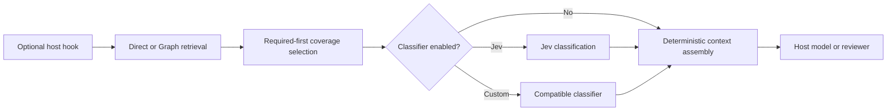

# RetrieVel Query-Aware Context Platform Roadmap

Status: active roadmap

Roadmap owner: Parent/PM

Created: 2026-09-22

Last updated: 2026-09-22

Source candidate at creation: `331b13ba0499bffcdb2f2b4dd79124c2dd0853ed`

Current milestone: `M09 — Multi-corpus evaluation`

Current gate: regenerate and validate the path-bound M09 manifest, then obtain exact re-ack before R2

Next action: compare each returned canonical task path with the frozen manifest before accepting a lane response

## Purpose

This document is the canonical roadmap and running registry for the next
RetrieVel product horizon. It replaces chat-only planning. Parent, workers, and
auditors must use this document for milestone status, accepted decisions,
handoffs, evidence links, and successor work.

The target outcome is:

> RetrieVel delivers equal or better accepted correctness with less irrelevant
> context and lower or neutral time-to-correct. Graph-only use remains fully
> supported. Jev remains optional. Other classification engines can implement
> the same bounded contract. Hosts can enable or disable each integration hook.

## Product Boundary

RetrieVel owns:

- verified Direct and Graph retrieval;
- required-evidence preservation;
- task-facet, coverage, diversity, and context-budget planning;
- provider-neutral classification requests and observations;
- optional Jev and custom-classifier adapters;
- transparent hook declarations;
- source-bound instruction, skill, context, and review plans.

The host owns:

- model and tool activation;
- permission enforcement;
- session and compaction lifecycle;
- worker scheduling and background execution;
- provider eligibility and sensitive-data policy;
- final application of RetrieVel plans.

A model or classifier may recommend. It cannot grant authority, expand source
scope, execute a tool, or remove required evidence.

## Operating Rules

1. Keep one active milestone unless write scopes and acceptance paths are
   demonstrably independent.
2. Parent owns this roadmap, integration, milestone acceptance, and successor
   routing. Workers return bounded receipts and do not create competing
   roadmaps.
3. Do not create a new benchmark version, release candidate, audit packet, or
   architecture layer for a harness-only repair.
4. Inspect one or two real failure cases before broad implementation or a full
   benchmark.
5. Preserve failed and rejected results in the registry. Do not rewrite them as
   accepted history.
6. Use the existing frozen candidates and stored Jev observations while the
   candidate packet is unchanged.
7. A changed candidate packet invalidates its stored Jev request hash and needs
   a fresh classification run.
8. Graph-only mode must need no API key, provider account, or network call.
9. All hooks are optional, visible, independently configurable, and safe to
   disable.
10. Mandatory workspace, repository, and nearest-path instructions are loaded
    deterministically. A classifier may add supplemental instructions but may
    not omit mandatory rules.
11. Run one independent audit only at a material architecture, security, or
    release boundary.
12. After two failures with the same signature and no changed hypothesis, stop
    micro-patching and redesign or split the milestone.

## Supported Product Modes

| Retrieval | Classification | Hooks | Supported outcome |
| --- | --- | --- | --- |
| Direct | Off | Off | Explicit verified Direct retrieval |
| Graph | Off | Off | Explicit verified Graph-assisted retrieval |
| Direct | Jev | Optional | Query-aware Direct context |
| Graph | Jev | Optional | Query-aware Graph context |
| Direct or Graph | Custom adapter | Optional | Provider-neutral classified context |
| Direct or Graph | Off | Optional | Deterministic hook plans without a classifier |

Disabling classification or hooks is normal operation, not a degraded state.

## Progress Summary

- [x] `M00` Record the canonical roadmap and accepted architecture boundaries.
- [x] `M01` Repair answer-context assembly on known answer-omission failures.
- [x] `M02` Confirm repeated correctness and locate each fact-loss boundary.
- [x] `M03` Generalize the proven context policy and classification contract.
- [x] `M04` Implement query-aware dynamic context planning.
- [x] `M05` Define transparent, optional plugin hooks.
- [x] `M06` Implement conditional instructions and structured skills.
- [x] `M07` Implement reusable read-only background-review packets.
- [x] `M08` Validate supported host boundaries and explicit adapters.
- [ ] `M09` Run the multi-corpus, repeated-trial evaluation.
- [ ] `M10` Complete release audit, packaging, documentation, and publication.

## Milestone Contracts

### M00 — Record the roadmap

Status: complete

Objective:

- Preserve the complete product direction, constraints, merge order, and
  evidence expectations in one repository-owned document.

Acceptance:

- The roadmap is linked from `docs/INDEX.md`.
- It names the current candidate, next milestone, decisions, status vocabulary,
  and update protocol.

### M01 — Repair answer-context assembly

Status: accepted

Objective:

- Correct the known loss of required and diverse evidence without changing the
  frozen candidate packets or stored Jev observations.

Implementation scope:

- Preserve the frozen evidence order and required candidates.
- Add one public-question completeness instruction at the answer boundary.
- Require the answer to state every requested rule, behavior, comparison,
  distinction, and consequence directly and cite its evidence.
- Keep grader facts, criticality, treatment labels, and oracle state private.
- Preserve current retrieval and selection behavior unless a frozen failure
  proves a defect in that layer.
- Quarantine `L-01` as comparative route evidence until its rubric is sound.

Acceptance:

- Required candidates remain present.
- Known critical facts survive final context assembly.
- Candidate and Jev hashes remain unchanged for this answer-handoff repair.
- Answer-request bytes receive a new identity and are not replayed as R7.
- Graph-only and Jev-off behavior remain functional.
- Focused tests cover the actual answer-context consumer.

Accepted proof:

- The exact retained `D-S-01` request improved from `4/5` to `5/5` required
  facts.
- The exact retained `D-L-01` request improved from `4/6` to `6/6` required
  facts.
- Both fresh grades reported zero unsupported material claims.
- The proof used no new retrieval, Jev, provider, or network call.
- This is a two-case answer-boundary proof. It is not full benchmark,
  time-to-correct, token, or product-package evidence.

Later M02 evidence limits this acceptance: two additional `D-L-01` answers
scored `5/6` and `4/6`. The instruction is useful but is not a sufficient
standalone completeness mechanism for complex synthesis.

Stop rule:

- If the known failure remains, classify it as retrieval absence, selection
  omission, answer-model omission, or grader rejection before another repair.

### M02 — Confirm repeated correctness

Status: accepted

Objective:

- Establish whether the M01 mechanism improves accepted correctness rather than
  one deterministic fixture.

Execution:

- Reuse the same tasks, models, questions, candidates, and stored Jev results.
- Run repeated answers per arm.
- Grade answers independently.
- Record each required fact at the retrieved, selected, presented, answered,
  and accepted boundaries.

Acceptance:

- Jev-on is non-inferior to Jev-off for critical facts.
- Graph does not lose required evidence.
- Every failure has a named boundary and evidence.

Accepted proof:

- Fresh `S-01` answers passed at `5/5` in all four arms. The repaired `D-S-01`
  also passed two additional independent runs at `5/5`.
- Public-question facet checklists produced fresh `L-01` answers at `6/6` in
  all four arms. Two additional independent `D-L-01` runs also passed at
  `6/6`.
- All fresh grades reported zero unsupported material claims.
- `B-D-01` remains a separately classified Direct retrieval absence because
  its required target never entered the frozen Direct candidate pool.
- No retrieval, Jev, provider, or network call was made. These checks do not
  establish time-to-correct or token improvement.

Stop rule:

- Do not generalize the architecture if selection does not cause a material
  failure or the repaired mechanism does not improve it.

### M03 — Generalize the context and classifier contracts

Status: accepted

Objective:

- Convert the proven behavior into one provider-neutral context planner and one
  bounded classification contract.

The accepted contract records:

- optional ordered public task facets on `RankedContextPlan`;
- selected and required candidates in the existing ranked projection;
- source coordinates, snapshot identity, and deterministic fallback in the
  existing ranked result;
- normalized candidate, query, source, request, order, and required-ID bindings
  for optional classifier observations.

Omitted-candidate explanations, unresolved-facet coverage, fidelity choice,
reuse state, and remaining budget belong to `M04`. They are not duplicated in
the M03 observation contract.

Classification modes:

- `none`: deterministic planning only;
- `jev`: TypeSafe/Jev adapter;
- `external`: compatible user-supplied adapter;
- `replay`: stored observation.

Acceptance:

- Graph-only output remains valid with classification `none`.
- Jev replay remains reproducible.
- A fixture custom adapter works without importing Jev code.
- Invalid or unavailable classification falls back to deterministic selection.

### M04 — Implement query-aware dynamic context

Status: accepted

Objective:

- Decide whether to reuse, refresh, rebuild, or widen context for the current
  query and source snapshot.

Initial fidelity choices:

- omit;
- bounded excerpt;
- full verified source unit.

Generated summaries remain out of scope until source units and excerpts prove
insufficient.

Acceptance:

- Context decisions retain provenance and required evidence.
- Query or snapshot changes invalidate unsafe reuse.
- Context bytes, fact coverage, and planning time are observable.
- Direct and Graph routes use the same context-plan contract.

Accepted proof:

- Existing complete-unit detection now reaches ranked candidates without
  changing candidate IDs or classifier packets.
- Plan telemetry records actual `omit`, `excerpt`, or `source_unit` decisions,
  included state, remaining budget, query and snapshot identities, and ordered
  public facets.
- A caller-supplied prior plan reports `reuse` only after current source
  revalidation and exact identity matches. Query changes refresh. Snapshot or
  candidate changes rebuild. A larger budget widens.
- Selection bytes, Direct/Graph routing, native Jev, external classification,
  and provider request hashes remain unchanged.
- No persistent cache, summary generator, provider call, or new context engine
  was added.

### M05 — Define optional plugin hooks

Status: accepted

Objective:

- Expose RetrieVel capabilities at host lifecycle boundaries without building a
  second agent runtime.

Initial hooks:

| Hook | Purpose | Initial default |
| --- | --- | --- |
| `before-context` | Build a query-aware context plan | explicit opt-in |
| `before-instructions` | Select supplemental instructions | off |
| `after-compaction` | Restore durable rules and source references | off |
| `before-capability-selection` | Recommend skills and tool categories | off |
| `after-change` | Build a read-only review packet | off |
| `on-review-idle` | Offer prepared work to a reviewer | off |
| `before-sensitive-action` | Return advisory risk classification | off |

Each hook manifest declares its trigger, reads, outputs, graph and classifier
dependencies, network behavior, external effects, default state, and fallback.

Acceptance:

- Every hook can be inspected and disabled independently.
- Hooks work with classification off.
- Unsupported host events fall back to explicit commands.
- Hooks do not grant permission or silently activate tools.

Accepted proof:

- A closed, package-owned manifest declares all seven lifecycle hook IDs with
  their reads, outputs, dependencies, network behavior, external effects,
  default state, fallback, and current implementation limit.
- Every hook is disabled by default and advisory. No hook declares network
  access, external effects, permission authority, or host interception.
- `before-context` names the existing `/graph-find --ranked-context plan`
  command as its explicit fallback. `after-change` names `/graph-update` and
  states that this refreshes graph data but does not create a review packet.
- Only `before-context` is an implemented capability. `after-change` is
  partial. The other five hooks remain declarations rather than false runtime
  claims.
- The focused manifest validator passed. Generated package inventory and a
  clean-mirror parity check covered 88 files.

### M06 — Conditional instructions and structured skills

Status: accepted

Objective:

- Supply task-relevant supplemental instructions and skill recommendations
  without weakening mandatory governance.

Instruction plan:

- mandatory inherited rules;
- selected supplemental sections;
- selection reason and source digest;
- considered but omitted sections.

Skill manifest:

- purpose and applicability;
- required context and tools;
- external effects and permission needs;
- expected output and validation;
- overlap or incompatibility with other skills.

Acceptance:

- Mandatory rules are never classifier-controlled.
- Skill selection does not activate tools by itself.
- Compaction or context refresh does not silently discard durable rules on a
  host that supports the required lifecycle hook.

Accepted proof:

- A provider-neutral instruction planner accepts an already-resolved ordered
  mandatory chain plus optional supplemental sections. It does not discover
  files or claim host interception.
- Mandatory sections remain exact and ordered. Selected and omitted
  supplemental sections carry distinct deterministic reasons, source paths,
  and content digests. Duplicate, unknown, malformed, or digest-mismatched
  inputs fail closed.
- The portable skill manifest describes all eight existing skills, including
  required context, tools, effects, permissions, output, validation, overlap,
  and incompatibility. Every entry is recommendation-only and non-implicit.
- `before-instructions` is now a partial capability with no host entry point.
  `after-compaction` and `before-capability-selection` remain declarations.
- Focused instruction, manifest, hook, and retention checks passed. Generated
  source/runtime files match. Clean-mirror package parity covered 91 files.
- No classifier, provider, network, skill activation, automatic instruction
  loading, host callback, or compaction callback was added.

### M07 — Reusable background-review packets

Status: accepted

Objective:

- Reuse one verified source snapshot and context plan across independent,
  read-only review work.

Initial mode: `packet_only`.

The packet records task, changed paths, selected context, applicable
instructions and skills, source snapshot, known risks, and review question.

Acceptance:

- Reviewers do not repeat repository discovery unnecessarily.
- Findings remain bound to the exact source snapshot.
- Background results are advisory unless deterministic project policy names a
  specific blocking check.

Accepted proof:

- The closed `review-packet-v1` contract binds the exact source snapshot,
  ranked context plan, instruction plan, skill manifest, selected source
  spans, changed paths, task, review question, known risks, and optional
  deterministic blocking-policy identity.
- Packet preparation revalidates exact source bytes and excerpt digests.
  Eligibility returns `stale_snapshot` before any source read and returns
  `source_mismatch` without discovery or fallback when bound bytes differ.
- Selected candidate IDs must equal the included context-fidelity decisions.
  The embedded skill manifest must match the accepted M06 closed entry shape.
- Every changed path must exist in the bound snapshot. Deleted or absent paths
  require a later diff-aware host review and are not represented as current
  source evidence.
- `graph-audit` documents the packet-only consumer path. No scheduler, worker
  runtime, lifecycle interception, provider call, network call, or finding
  engine was added.
- Forty-six focused core and consumer tests passed. Canonical and generated
  packet sources and schemas match. Clean-mirror package parity covered 93
  files with candidate SHA-256
  `2f5307ff99fb802c1f6de2a5335a21cf973da137cff6be38aafceaef190462b0`.

### M08 — Host boundaries and explicit adapters

Status: accepted

Objective:

- Translate only verified host invocation surfaces into RetrieVel calls and
  record unsupported lifecycle surfaces without inventing an adapter.

Order:

1. Codex installed-plugin adapter.
2. Orcastrata consumption through its capability and context-pack boundaries.
3. Other hosts only when their lifecycle APIs and product need are verified.

Acceptance:

- Adapters contain translation, not duplicate retrieval logic.
- Feature availability and actual activation are separately observable.
- No adapter claims global interception that the host does not support.
- Explicit commands remain a functional fallback.

Accepted proof:

- The Codex package exposes six static command-to-skill prompt bridges. No
  repository-owned lifecycle callback, dispatcher, interceptor, or automatic
  activation API exists. All seven hook declarations continue to report an
  unavailable host entry point.
- The only supported Codex integration is explicit command invocation. The
  `/graph-find --ranked-context plan` path reaches the existing retrieval and
  ranked-context contracts. `/graph-update` remains the explicit after-change
  fallback.
- The existing Orcastrata umbrella-catalog adapter is a supplied-artifact,
  navigation-only intake boundary. It does not consume context plans or review
  packets and does not invoke Orcastrata, GoalBuddy, WorkGraph, a capability
  backend, or a provider.
- AOL context packs and capability invocation are distinct host-owned systems.
  No shared serialized consumer contract or verified lifecycle event exists,
  so no new translation layer was added.
- One explicit-command discovery check and all nine Orcastrata adapter tests
  passed. The locally installed `graph-engineering` plugin remains version
  `0.1.6`; this does not prove installation of the `0.2.0-rc.1` worktree
  candidate. Fresh candidate installation remains an M10 release check.

### M09 — Multi-corpus evaluation

Status: active

Objective:

- Evaluate the accepted mechanism beyond the known small task canary.

Corpus classes:

- comprehensive multi-language software repository;
- many smaller heterogeneous documents;
- one large coherent body of work;
- governance or operational material with rules and provenance.

Primary arms:

- Direct with static context;
- Graph with static context;
- Direct with query-aware classification;
- Graph with query-aware classification.

Measures:

- accepted correctness and critical-fact recall;
- source support and false omission;
- final answer-context bytes;
- all-model input and output tokens;
- retrieval, classification, and end-to-end accepted time;
- calls, cost, fallback, graph reuse, and hook overhead.

Acceptance:

- Repeated trials support the result.
- The candidate is non-inferior on critical correctness.
- Any context or time improvement is measured end to end.
- Negative or corpus-specific results remain visible.

### M10 — Audit, package, and release

Status: queued

Objective:

- Release one accepted candidate with accurate public claims.

Required work:

- freeze public schemas;
- complete one independent architecture and security audit;
- document Graph-only, Jev, and custom-classifier use;
- publish the hook capability and data-exposure matrix;
- validate canonical/runtime projection and package parity;
- test installation in a fresh project;
- run focused, consumer, package, and justified full validation;
- create one release candidate from the accepted implementation;
- run one final audit against that exact candidate.

Acceptance:

- Packaging, installed behavior, documentation, and benchmark claims describe
  the same candidate.
- Superseded remote branches are closed or removed after their value is folded
  in.
- Local retained evidence is ignored when it does not belong in the package.

## Pull Request And Merge Order

Use at most four coherent implementation pull requests unless a material defect
class requires a split:

1. **Context repair:** `M01–M02`.
2. **Dynamic context and classification contract:** `M03–M04`.
3. **Plugin hooks and capabilities:** `M05–M07`.
4. **Host adapters and release:** `M08–M10`.

Each pull request begins from the merged predecessor. Do not let parallel
branches redefine the same context schema. Close or delete superseded remote
branches after the accepted work is preserved.

## Active Work Registry

Only Parent updates milestone acceptance in this table. Parallel workers return
receipts for Parent integration.

| Work ID | Milestone | Owner | Write scope | Status | Receipt or blocker |
| --- | --- | --- | --- | --- | --- |
| `W000` | `M00` | Parent | This roadmap and `docs/INDEX.md` | complete | Roadmap creation; no product implementation |
| `W001` | `M01` | Codex task `01a0c955-ec89-7db3-9454-8f74e2f16f58` | answer-boundary completeness instruction and focused tests | complete | Minimal v3-only instruction; 25 focused tests passed with 1 retained skip |
| `W002` | `M01` | Luna `/root/m01_failure_boundary` | read-only frozen-result diagnosis | complete | `B-D-01` target was absent from the Direct pool before Jev; no selection loss |
| `W003` | `M01` | Luna `/root/m01_selection_policy` | read-only source and test review | complete | Three Jev-on failures had source evidence but no model-visible coverage checklist |
| `W004` | `M01` | Luna answer lanes and independent Astra grader | exact retained `D-S-01` and `D-L-01` answer requests | complete | Refined instruction scored `5/5` and `6/6`; zero unsupported material claims |
| `W005` | `M02` | Parent | repeated frozen answer and grade confirmation | complete | `D-S-01` repeated `5/5`; `D-L-01` repeated `5/6` and `4/6`; prompt-only repair is not repeatable |
| `W006` | `M02` | Luna `/root/m02_facet_boundary` and implementation task `01a0c955-ec89-7db3-9454-8f74e2f16f58` | read-only task-facet redesign | complete | The public question and retained evidence contained every missing facet; explicit decomposition was the smallest causal test |
| `W007` | `M02` | parallel Luna answer lanes and independent Astra graders | fresh frozen `S-01` and `L-01` answer-grade pairs | complete | `S-01` passed `5/5` and `L-01` passed `6/6` in all four arms; no provider calls |
| `W008` | `M03` | Codex task `01a0c955-ec89-7db3-9454-8f74e2f16f58` | optional provider-neutral task-facet contract and focused tests | complete | Host checklist plus installed `RankedContextPlan.task_facets`; absent facets preserve byte-compatible Graph-only plan output |
| `W009` | `M03` | Codex task `01a0c955-ec89-7db3-9454-8f74e2f16f58` | normalized classifier observation seam and custom-adapter fixture | complete | External adapter reranks with Jev disabled; stale, invalid, unavailable, or conflicting observations retain baseline |
| `W010` | `M04` | Parent plus implementation task `01a0c955-ec89-7db3-9454-8f74e2f16f58` | query-aware context fidelity and reuse plan | complete | Metadata-only extension; actual selection and classifier packets unchanged |
| `W011` | `M05` | Parent plus implementation task `01a0c955-ec89-7db3-9454-8f74e2f16f58` | optional hook manifests and explicit-command fallback | complete | Seven closed declarations; all off and advisory; only existing command fallbacks claimed |
| `W012` | `M06` | Parent plus Luna discovery and implementation task `01a0c955-ec89-7db3-9454-8f74e2f16f58` | provider-neutral instruction plan and structured skill metadata | complete | Pure caller-supplied plan, eight-skill advisory manifest, and 91-file package parity |
| `W013` | `M07` | Parent plus Luna discovery and implementation task `01a0c955-ec89-7db3-9454-8f74e2f16f58` | source-bound read-only review packet and explicit consumer path | complete | Closed snapshot-bound packet; 46 focused tests and 93-file package parity passed |
| `W014` | `M08` | Parent plus Luna discovery and implementation task `01a0c955-ec89-7db3-9454-8f74e2f16f58` | verified Codex and Orcastrata translation seams only | complete | Explicit Codex command seam and navigation-only Orcastrata intake verified; no lifecycle API exists |
| `W015` | `M09` | Parent plus implementation task `01a0c955-ec89-7db3-9454-8f74e2f16f58` | frozen multi-corpus four-arm evaluation | active | R1 stopped before response capture because the launcher returned `/root/m09_r1_luna_answer_a_s_01`, while the manifest bound only `m09_r1_luna_answer_a_s_01`. Its answer was incomplete. No Jev/provider call ran. Successor approval is reset. The human approved a versioned path-binding change and one A-S-01 replacement; obtain a new exact re-ack before R2. |

## Decision Registry

| Date | Decision | Reason | Revisit condition |
| --- | --- | --- | --- |
| 2026-09-22 | Graph-only remains first-class. | Retrieval must not require an external provider. | Never remove without a public product decision. |
| 2026-09-22 | Jev is an optional classifier adapter. | The core contract must support other classification engines. | Revisit only if a required Jev capability cannot fit the neutral contract. |
| 2026-09-22 | Coverage and diversity precede classifier relevance. | Individually relevant fragments can omit unique critical facts. | Revisit after held-out evidence shows a better policy. |
| 2026-09-22 | Hooks are transparent and independently optional. | Users must understand data access, effects, and fallback. | Revisit per verified host limitation. |
| 2026-09-22 | Mandatory instructions are deterministic. | A probabilistic classifier cannot weaken governance. | Never weaken without an explicit authority decision. |
| 2026-09-22 | Background review starts as packet-only. | Scheduling and concurrency are host responsibilities. | Add automatic mode after one host adapter proves lifecycle control. |
| 2026-09-22 | Do not add generated summaries initially. | Excerpts and full source units provide a smaller causal test. | Add only if fidelity evaluation shows a material gap. |
| 2026-09-22 | Do not treat the `B-D-01` Direct failure as a selection defect. | The frozen 64-candidate Direct pool contains no `sorts/quick_sort.py`; Graph added that relationship evidence by design. | Revisit Direct source-local import completion as a separate query-aware retrieval experiment. |
| 2026-09-22 | Do not compile answer obligations from lexical question terms. | The attempted compiler produced zero useful spans on real retained cases and bound unrelated sources. | Revisit only with a source-semantic method that proves correct spans before integration. |
| 2026-09-22 | Use one v3-only public-question completeness instruction for M01. | It repaired both retained answer omissions without changing evidence, schemas, Jev observations, or exposing grader facts. | Revisit after M02 repeated confirmation or a new failure mechanism. |
| 2026-09-22 | Generalize explicit public-question facets, not task-specific prompt text. | The generic instruction was inconsistent on `L-01`; an explicit five-part decomposition passed every arm and two extra repeats. | Revisit if the provider-neutral contract cannot create or accept facets without hidden rubric data. |
| 2026-09-22 | Normalize classifier output at selection, not transport. | Provider endpoint, model, rubric, and replay remain adapter concerns; selection needs only verified hashes, order, required IDs, and non-authority status. | Revisit if another classifier requires a selection operation other than bounded reranking. |
| 2026-09-22 | Treat context reuse as caller-supplied plan reuse, not hidden persistence. | The CLI has no cache service; current reader validation plus exact query, snapshot, candidate, facet, and budget identities provide the smallest safe boundary. | Add persistence only after a host proves a lifecycle and eviction need. |
| 2026-09-22 | Hook declarations describe capability, not host installation. | Static package metadata cannot prove that a host supports or invokes a lifecycle event. | Change a status only after an installed adapter exercises the event. |
| 2026-09-22 | Instruction inheritance remains a host-resolved input. | RetrieVel has no canonical nearest-path loader and must not infer or weaken host governance. | Add a loader only inside a host adapter with a verified precedence contract. |
| 2026-09-22 | Structured skill metadata remains recommendation-only. | A manifest can describe applicability and effects but cannot grant authority or activate tools. | Revisit activation only through a verified host capability boundary. |
| 2026-09-22 | Review packets support current snapshot members only. | A snapshot cannot prove deletion bytes or diff semantics; accepting absent changed paths would create false evidence. | Add deleted-path support only through a verified diff-aware host adapter. |
| 2026-09-22 | M08 starts with capability discovery, not a generic adapter framework. | Static metadata cannot prove lifecycle interception, and translation code has value only when a real host seam exists. | Implement the smallest verified Codex or Orcastrata invocation path. |
| 2026-09-22 | Accept explicit commands as the current Codex adapter boundary. | The package proves command-to-skill translation but exposes no lifecycle callback API. | Add automatic hooks only when Codex publishes and the package exercises a real host event. |
| 2026-09-22 | Do not map RetrieVel into AOL's capability invocation bus. | That bus executes backends and records invocations; it is not a context-selection consumer. | Add an Orcastrata context adapter only after the host owns a shared serialized context-pack contract. |
| 2026-09-22 | Use the existing 16-trial successor study for M09 instead of adding a D-01-only runner. | Exact D-01 artifact inspection proved the causal retrieval boundary, and the current runner has no subset mode. A new subset framework would add harness work without product evidence. | Split the study only if the existing run cannot isolate a material failure. |

## Evidence And Attempt Registry

Add one row for each materially distinct candidate, failure class, benchmark,
or accepted phase. Merge retries with identical inputs and failure signatures.

| Date | Milestone | Candidate or attempt | Validation tier | Result | Decision and next step |
| --- | --- | --- | --- | --- | --- |
| 2026-09-22 | `M00` | Roadmap at source candidate `331b13b` | structural | recorded | Start `M01`; no implementation or benchmark claim |
| 2026-09-22 | `M01` | Source-diversity selection patch | focused | rejected | Patch targeted no proven selection defect and changed all-fit Jev semantics; fully reverted; 19 selection and 15 dependent tests passed |
| 2026-09-22 | `M01` | Frozen R7 Jev-on failure trace | real-artifact diagnosis | classified | `B-D-01` is pre-Jev Direct candidate absence; `B-L-01`, `D-L-01`, and `D-S-01` are answer omissions after evidence delivery |
| 2026-09-22 | `M01` | Direct ordered-import completion | source and caller review | rejected | Recovery used relationship derivation inside Direct, changed the benchmark treatment, and mislabeled the added hit as exact; revert before obligation work |
| 2026-09-22 | `M01` | Lexical obligation sidecar and compiler | focused plus real retained-corpus inspection | rejected | Focused tests passed, but retained `S-01` and `L-01` produced zero obligation spans and unrelated source bindings; fully reverted |
| 2026-09-22 | `M01` | Initial public-question completeness instruction | exact retained answers and independent grades | partial | `D-L-01` improved to `5/6`; `D-S-01` stayed `4/5`; both exposed missing implicit consequences |
| 2026-09-22 | `M01` | Refined v3-only completeness instruction | focused plus exact retained answers and independent grades | accepted | 25 focused tests passed with 1 retained skip; `D-S-01` scored `5/5`, `D-L-01` scored `6/6`, and both had zero unsupported material claims; no provider calls |
| 2026-09-22 | `M02` | Two independent repeats of the refined instruction | exact retained answers and independent grades | failed repeatability gate | `D-S-01` passed twice at `5/5`; `D-L-01` scored `5/6` and `4/6`; both failures omitted source-supported general guidance; stop prompt micro-patching and design an explicit source-bound task-facet handoff |
| 2026-09-22 | `M02` | Public-question facet checklist on `D-L-01` | two independent fresh answers and grades | accepted causal check | Both answers scored `6/6` with zero unsupported material claims; no provider calls |
| 2026-09-22 | `M02` | Four-arm `L-01` and `S-01` confirmation | fresh answers and independent grades over exact retained requests | accepted | `L-01` scored `6/6` and `S-01` scored `5/5` in A/B/C/D; grader transport exposed embedded prior answer text but answer lanes remained blind; no Jev or source changes |
| 2026-09-22 | `M03` | Optional public task-facet handoff | focused host and core tests plus generated runtime comparison | accepted component | Host converts validated facets into a deterministic checklist; installed `RankedContextPlan` carries optional facets without changing selection or Jev packets; 28 host/packet tests and 21 core tests passed, with 1 retained skip and byte-identical canonical/runtime selection source |
| 2026-09-22 | `M03` | Normalized external-classifier observation | focused core tests, generated runtime comparison, and clean-mirror package parity | accepted | Standard-library fixture adapter reranked with Jev disabled; invalid, stale, unavailable, and conflicting observations retained baseline; source-aware telemetry no longer attributes external classification to Jev; 24 focused tests passed and clean-mirror parity covered 87 files |
| 2026-09-22 | `M04` | Additive context-fidelity and reuse telemetry | focused ranked-context and real retrieval-builder checks plus generated runtime comparison and clean-mirror parity | accepted | Complete and bounded units propagate through the real builder; plans report honest included/mode state and identity-bound reuse; 26 ranked-context tests and the targeted retrieval test passed; canonical/runtime files match and parity covered 87 files |
| 2026-09-22 | `M05` | Closed optional-hook declaration manifest | focused manifest validation, JSON parse, generated inventory, and clean-mirror parity | accepted | Seven hooks are inspectable and independently off by default; no runtime, permission, network, or interception claim was added; package parity covered 88 files |
| 2026-09-22 | `M06` | Provider-neutral instruction plan and eight-skill manifest | focused core, hook, skill, retention, projection, runtime, and clean-mirror parity checks plus independent read-only review | accepted | Mandatory sections remain exact and outside classifier control; supplemental sections are explicit; skills remain advisory; two review findings were repaired; package parity covered 91 files |
| 2026-09-22 | `M07` | Closed source-bound review packet and `graph-audit` packet-only consumer | 46 focused core and consumer tests, canonical/runtime comparison, schema parse, diff check, and clean-mirror parity | accepted | Packet identity covers every envelope field; stale state stops before reads; no scheduler or finding engine was added; package parity covered 93 files |
| 2026-09-22 | `M08` | Codex command and Orcastrata consumer-boundary discovery | read-only caller trace plus one command-discovery and nine adapter tests | accepted boundary | Existing explicit commands and navigation-only catalog intake are real; lifecycle and context-pack adapters are unsupported, so no speculative code was added |
| 2026-09-22 | `M09` | Existing four-arm freeze against the M01-M08 candidate | full-suite preflight with the declared dependency environment | failed binding gate | Scaffold 11, core 305, adapters 18, and skills 40 passed; benchmark suite stopped with 29 errors and 1 failure because historical validation compared frozen implementation hashes with current worktree bytes; repair the validator and rebind the existing successor artifacts before calls |
| 2026-09-22 | `M09` | Historical binding validation and successor refresh repair | full benchmark suite plus package parity | accepted harness repair | Historical implementation hashes now resolve from their bound Git commit; stale successor bindings can refresh without inheriting approval; 212 benchmark tests passed with 3 unavailable-lane skips, package parity covered 93 files, and the refreshed successor remains pending fresh lane bindings and approval |
| 2026-09-22 | `M09` | Exact D-01 Direct/Graph and Jev artifact inspection | real-artifact causal checkpoint | accepted diagnostic | Direct had no `sorts/quick_sort.py` candidate; Graph added and selected one source-witnessed relationship candidate. Stored B/D Jev request hashes exactly match the current pools. Graph+Jev retained the target and passed `3/3`; Direct+Jev could not add the absent target and failed `1/3`. This permits the existing full successor run but is not current-candidate performance proof. |
| 2026-09-22 | `M09` | Current successor execution dry preparation | read-only integrated preflight | failed transition gate | Current preparation produces pool hash `bf6ea247...` and preflight hash `a3c4469e...`, not the frozen `3721b737...` and `4c329a1a...`; preparation fails closed. The harness also has no command that binds a newly frozen lane manifest into the pending TTC contract. Repair these two explicit transitions before lanes or calls. |
| 2026-09-22 | `M09` | Current-candidate pool refresh and explicit lane-manifest binding | focused harness and successor validation | accepted harness repair | `freeze-successor --refresh` and `prepare-successor-execution` now bind current preflight `a3c4469e...` and pool `bf6ea247...`. `bind-successor-lanes` validates and binds a fresh 32-entry manifest plus exact Python path without inheriting approval. Historical and successor validators pass; 37 benchmark tests pass with 2 unavailable-lane skips. State remains pending, execution disabled, and provider spend unauthorized. |
| 2026-09-22 | `M09` | Fresh M09 R1 lane freeze and pending binding | offline authority preparation | ready for re-ack | Manifest `4dd216489009e1f1d22db14545f96b902aae20e5a20c42ba56ad474392b61474` binds 16 Luna answer and 16 Astra grader task names plus the declared Python executable. Successor freeze is `5cfd441f...`; preflight is `4a51506f...`. No task, model, Jev, provider, credential, or network call occurred. |
| 2026-09-22 | `M09` | Installed-copy manifest integrity and graph-find timeout receipts | focused harness regression checks | accepted harness repair | Existing run roots now reject unmanifested files and symlinks. Graph-find timeouts retain a hash-only process receipt and classify as `callback_timeout`. Three focused installed-path tests passed. No M09 lanes or provider calls were run; exact re-ack is still required. |
| 2026-09-22 | `M09` | Refreshed successor freeze, pool, 32-lane manifest, and interpreter binding | offline authority preparation | approved for execution | Pool `bf6ea247...`, freeze `06edacc2...`, preflight `37baa8b0...`, and manifest `dad4599b...` validated before approval. The manifest binds 16 GPT-5.6 Luna answer lanes and 16 GPT-6 Astra grader lanes to `/opt/homebrew/opt/python@3.14/bin/python3.14`. The final exact re-ack bound request hash `80b3411f...`, total authorized USD 1.0000, operator-reported spend USD 0.0969, maximum additional USD 0.9031, eight Jev calls, and zero retries. Approval is materialized in successor contract `1dbadd5c...`; counters were zero at approval. |
| 2026-09-22 | `M09` | R1 first answer-lane dispatch | execution-integrity preflight | stopped; no accepted trial result | The controller bound clean commit `e0f382997efa9b12b159235b8da5e05badd6dde5` and wrote the `A-S-01` answer request. The native launcher returned task identity `/root/m09_r1_luna_answer_a_s_01`, which does not equal manifest identity `m09_r1_luna_answer_a_s_01`; its response also omitted required answer facts. Per protocol, Parent did not capture or attest the response. Parent stopped the controller before any grader or Jev call. The handoff receipt remains `request_written` with no response hash. The zero-retry rule prevents another dispatch under this manifest. |
| 2026-09-22 | `M09` | Revoke R1 approval after lane-identity mismatch | offline fail-closed reset | stopped; execution disabled | `freeze-successor --refresh` returned the successor contract to `pending_lane_manifest_and_final_user_reack`; `validate-successor-overlay` reports `execution_ready: false`, no lane manifest bound, and zero planned calls executed. No Jev/provider call ran. The pending request requires a matching lane-launch identity path or an explicit protocol change, then a new manifest and exact re-ack. |

| 2026-09-22 | `M09` | Versioned canonical task-path binding and one A-S-01 replacement | 79 benchmark and handoff tests; successor and manifest validators | pending new exact re-ack | Lane manifest v2 `5e997dde...` binds each task path and task-name alias. Successor freeze `54d904a4...` and preflight `86825074...` validate. The contract records the excluded R1 answer-agent turn and permits exactly one A-S-01 replacement. Other lanes and Jev calls retain zero retries. No new lane or provider call occurred; 2 tests skipped because frozen corpus lanes are unavailable. |

## Handoff Protocol

Every new Parent or worker must:

1. Read repository `AGENTS.md`, `README.md`, `docs/INDEX.md`, and this roadmap.
2. Record current HEAD and `git status --short` before edits.
3. Confirm the active work item, write scope, dependencies, and acceptance gate.
4. Reuse the accepted candidate and evidence. Do not restart from chat history.
5. Avoid overlapping writers. Parent transfers write ownership only after the
   prior writer and pending tool calls have stopped.
6. Return changed paths, commands, results, assumptions, exact failures, and
   the recommended successor.
7. Parent integrates or rejects the work, updates the registries, and advances
   only the accepted milestone.

A handoff is incomplete when it contains only a branch name, test count, model
narration, or proposed next action.

## Status Vocabulary

- `queued`: depends on an earlier milestone.
- `ready`: inputs and acceptance criteria exist; work has not started.
- `active`: one owner is executing the milestone.
- `audit`: implementation is complete and an independent review is required.
- `accepted`: Parent verified the milestone oracle.
- `rejected`: the candidate failed its oracle and remains evidence.
- `blocked`: no authorized in-scope successor exists without a human or
  external-state change.
- `superseded`: a later accepted candidate replaces this item.

## Roadmap Update Protocol

After each material work period, Parent must update:

1. `Last updated`, `Current milestone`, `Current gate`, and `Next action`.
2. The milestone checkbox and status.
3. The Active Work Registry.
4. The Evidence And Attempt Registry.
5. The Decision Registry when a decision changes.
6. Pull request, commit, benchmark, audit, or receipt references.

Do not create a second roadmap, failure ledger, or handoff document that repeats
this state. Create another artifact only for a distinct consumer, such as a
frozen benchmark result, public release note, or independent audit report.
